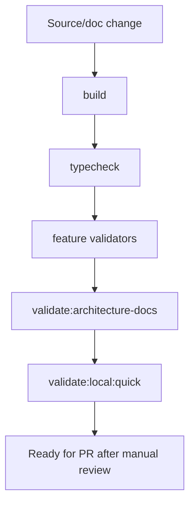

# Validation Flow

[Docs index](../../README.md)

## Purpose

This document describes how local validation gates source changes and documentation changes.

## Current implementation

The root scripts run build, typecheck, structure checks, Project Graph checks, Preview checks, DOM Snapshot checks, Selection checks, Inspector checks, Design Canvas checks, Visual Selection Overlay checks, Element Library checks, Source Patch Preview checks, UI flow checks, watcher checks, and Electron diagnostics.

## Key files

- `package.json`
- `scripts/validate-local.mjs`
- `scripts/validate-structure.mjs`
- `scripts/validate-ui-flow.mjs`
- `scripts/validate-source-patch-preview.mjs`
- `scripts/validate-architecture-docs.mjs`

## Data flow

Validation scripts read source and docs, fail fast with explicit messages, and do not mutate runtime source. The docs validator is an additional static gate for architecture documentation integrity.

## Boundaries

Validation must not hide implementation gaps. Passing docs validation does not mean runtime behavior is implemented. It only means the docs set is present and internally navigable.

## Validation

Run `npm run validate:architecture-docs` for docs and `npm run validate:local:quick` for current installed local source validation.

## Related docs

- [Validation system](../validation-system.md)
- [Validation gates diagram](../diagrams/validation-gates.md)
- [Repository map](../repository-map.md)

## Future work

Add import boundary validation and docs-to-source path validation after the documentation surface stabilizes.
