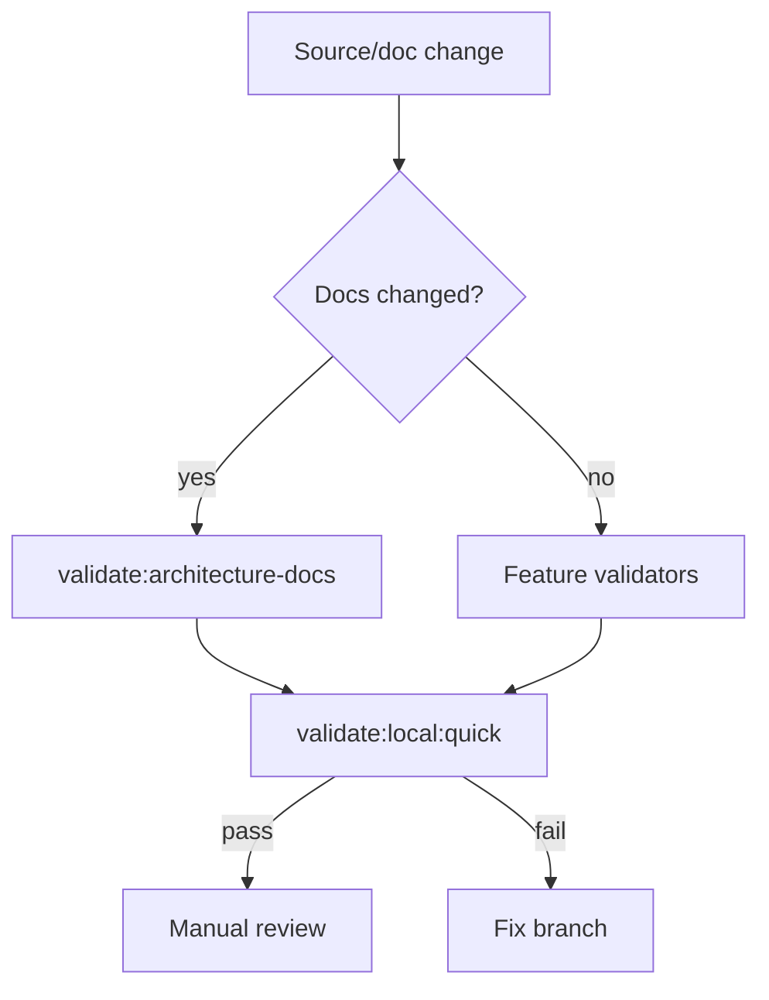

# Validation Flow

[Docs index](../../README.md)

## At a glance

| Question | Answer |
| --- | --- |
| Is this implemented? | Yes. |
| Can validators mutate files? | No. |
| Runtime owner | Node validation scripts and npm command graph. |
| Safety risk controlled | Keeps blocked behavior and docs claims honest. |
| Related next phase | Import-boundary and write-runtime validators. |

## Purpose

Validation flow explains how a change is checked before it is trusted. It matters because many Crystal guarantees are negative guarantees: no renderer filesystem access, no live iframe DOM reads, no write IPC, no patch application, and no real undo/redo.

## Why this exists

Validation makes architectural boundaries executable enough to catch accidental regressions.

## How to read this page

Use the flow summary to choose the right validation command for the branch type.

## Current implementation

The root scripts run build, typecheck, structure checks, feature validators, watcher checks, Electron diagnostics, and architecture documentation checks. Validators are source readers, not source modifiers.

| Implemented | Blocked | Future |
| --- | --- | --- |
| Docs validator. | Auto-fixing docs. | Docs path drift checks. |
| Feature validators. | Hidden source mutation. | Import-boundary checks. |
| Local aggregate runner. | Treating docs validation as runtime proof. | Write runtime validators. |

## Flow summary

| Step | Actor | Input | Decision | Output |
| --- | --- | --- | --- | --- |
| 1 | npm script | Command name | Which validation graph? | Docs, quick, or full runner. |
| 2 | Validator | Source/docs files | Do required constraints hold? | Pass or explicit failure. |
| 3 | Aggregate runner | Step result | Did command pass? | Continue or stop. |
| 4 | User/reviewer | Validation result | Is branch ready? | Manual review or fixes. |

## Key files

Read `package.json` for the command graph, then the specific validator for the feature being changed.

## Key files and responsibilities

| File | Responsibility | Reads | Must not do |
| --- | --- | --- | --- |
| `package.json` | Validation script graph. | Command names. | Add dependencies for docs. |
| `validate-local.mjs` | Aggregate runner. | npm commands. | Hide failures. |
| `validate-architecture-docs.mjs` | Docs shape/safety checks. | Markdown docs. | Replace runtime validators. |
| `validate-source-patch-preview.mjs` | Command preview safety. | Source files. | Permit writes. |
| `validate-ui-flow.mjs` | Shell/UI flow checks. | Renderer source. | Change app behavior. |

## Data flow

Validation scripts inspect source, docs, fixtures, and expected strings. They fail with explicit messages and exit non-zero.

## Main diagram

## Failure and blocked states

| State | Why it happens | What Crystal does |
| --- | --- | --- |
| Missing doc | Required docs path absent. | Docs validator fails. |
| Forbidden claim | Docs claim future write behavior. | Docs validator fails. |
| Runtime regression | Feature guard fails. | Local validation fails. |
| No local checkout | Commands cannot run in connector-only context. | Report not executed honestly. |

## Boundaries

Passing docs validation does not mean a future feature exists. Passing runtime validation does not allow docs to claim a blocked feature is implemented.

## What this does not do

| Not provided | Reason |
| --- | --- |
| Runtime proof from docs | Different validation layer. |
| Source mutation | Validators read and fail only. |
| PR merge decision | Manual and CI review still needed. |

## Common misunderstanding

> **Common misunderstanding:** Validation is a gate, not evidence that future capabilities are present.

## Validation

Run `npm run validate:architecture-docs` for docs and `npm run validate:local:quick` for installed local source validation.

## Related docs

- [Validation system](../validation-system.md)
- [Validation gates diagram](../diagrams/validation-gates.md)
- [Repository map](../repository-map.md)

## Future work

Add import-boundary validation and docs path drift checks after the documentation surface stabilizes.
