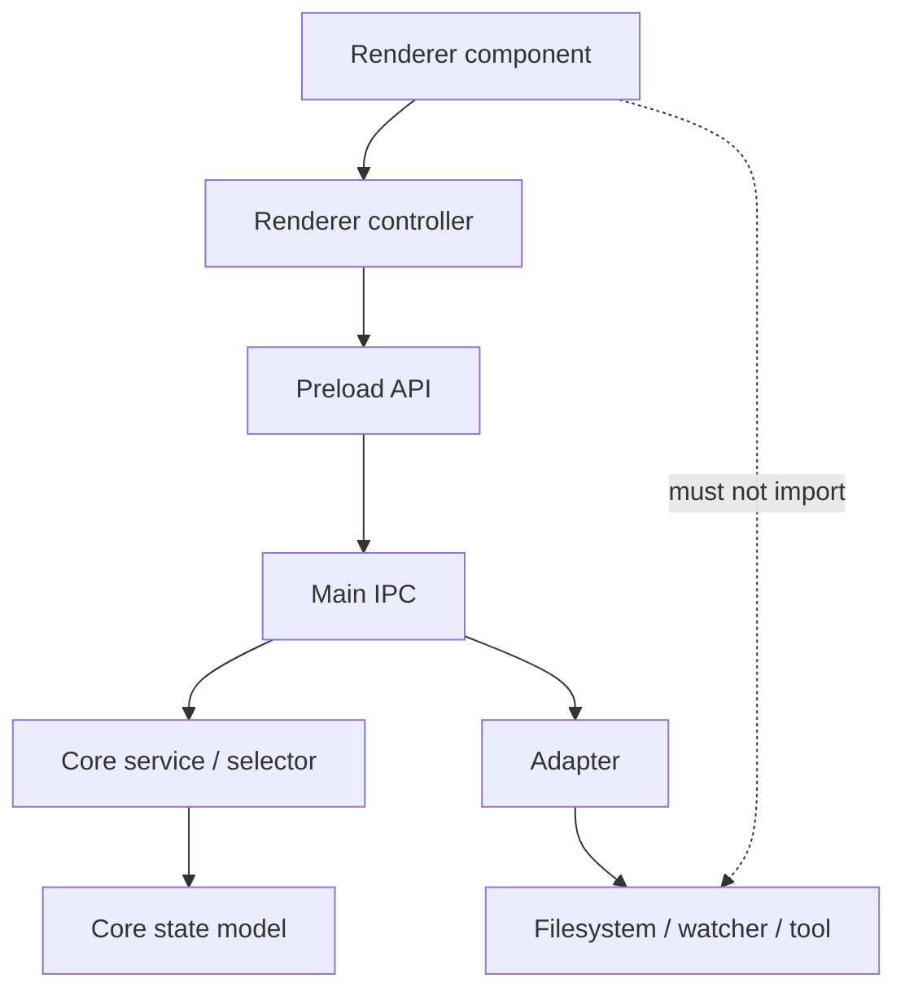

# Module Boundaries

[Docs index](../README.md)

## Purpose

This document defines how Crystal modules should depend on each other. The goal is high interconnection without direct coupling between unrelated layers.

## Current implementation

Current modules are split by runtime and domain. Renderer components compose UI. Core packages define models, selectors, validators, planners, state, and commands. Adapters isolate Node or external-tool effects. Shared packages hold cross-runtime contracts.

## Key files

- `apps/desktop/electron/renderer/components/**`
- `apps/desktop/electron/renderer/views/design/design.html`
- `apps/desktop/electron/main/ipc/register-project-ipc.ts`
- `packages/core/project/**`
- `packages/core/commands/**`
- `packages/core/source-patch/**`
- `packages/adapters/file-system/file-system.adapter.ts`
- `packages/adapters/file-watcher/file-watcher.adapter.ts`
- `packages/shared/**`

## Data flow

A renderer module may import UI helpers, renderer-local state, and core types/selectors when they are safe for browser runtime. Privileged operations cross through preload and IPC. Main coordinates adapters and stores authoritative project runtime state. Core functions should remain testable without Electron.

## Boundaries

A UI panel must not directly import filesystem adapters, watcher adapters, protocol handlers, or Electron main services. Main process code must not depend on renderer DOM implementation. Core command preview modules must not import renderer components. Source patch preview modules must not write files.

## Validation

Structure and feature validators enforce the highest-risk boundaries. The documentation validator ensures boundary docs stay present and cross-linked, but source-level import enforcement should be expanded in a later validation phase.

## Related docs

- [Repository map](./repository-map.md)
- [Runtime boundaries](./runtime-boundaries.md)
- [Command Preview Bus](./commands/command-preview-bus.md)
- [Future command execution](./commands/future-command-execution.md)

## Future work

Add import-boundary validation for renderer-to-main, core-to-renderer, adapter leakage, and future worker/WASM/WebGPU modules. This should happen before write-capable features become normal user flows.
