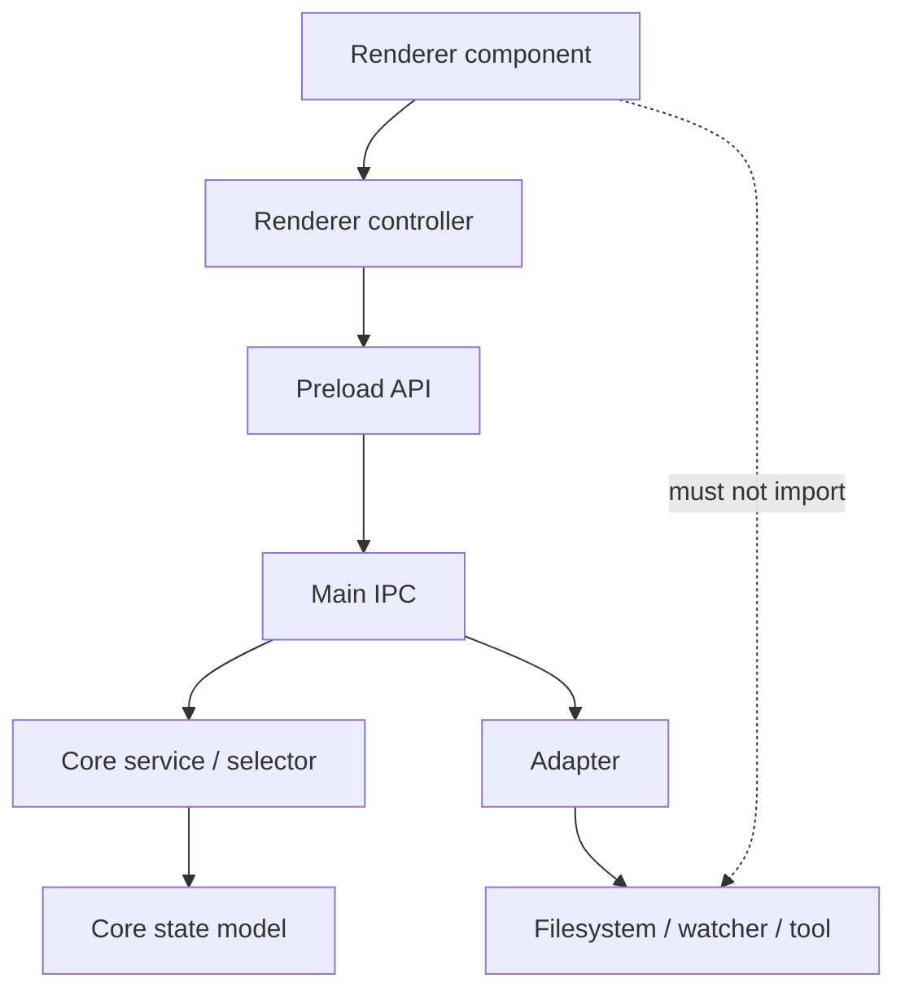

# Module Boundaries

[Docs index](../README.md)

## Purpose

Crystal is intentionally modular, but modularity is only useful if dependencies point in predictable directions. This page explains which layers may know about each other and which shortcuts would make the system harder to secure, validate, or evolve.

## Current implementation

Renderer components compose UI and hold only local interaction state. Core packages define portable models, validators, selectors, and planners. Main process modules coordinate Electron, filesystem, watcher, Preview protocol, and service state. Adapters isolate Node or external-tool effects. Shared packages carry contracts that must be used on both sides of a runtime boundary.

The diagram shows the intended dependency chain. UI may request work, but it should not import the effect that performs it.

## Key files

This list gives representative entry points for each layer. When changing a feature, follow the nearest path downward instead of reaching sideways into another runtime.

- `apps/desktop/electron/renderer/components/**`
- `apps/desktop/electron/renderer/views/design/design.html`
- `apps/desktop/electron/main/ipc/register-project-ipc.ts`
- `packages/core/project/**`
- `packages/core/commands/**`
- `packages/core/source-patch/**`
- `packages/adapters/file-system/file-system.adapter.ts`
- `packages/adapters/file-watcher/file-watcher.adapter.ts`
- `packages/shared/**`

## Data flow

A renderer panel can import browser-safe types and pure selectors, then call preload for privileged work. Main receives the request and delegates to core or adapters. Core returns model state or dry-run planning results. Renderer turns that state into UI. The path is longer than a direct import, but it keeps responsibility visible.

## Boundaries

A UI panel must not import filesystem adapters, watcher adapters, protocol handlers, or Electron main services. Core command preview modules must not import renderer components. Source patch modules must not write files. These boundaries reduce circular dependencies and make it possible to validate that preview code does not quietly become execution code.

## Validation

Current validators focus on the highest-risk feature boundaries. Import-boundary validation is still future work, so reviewers should treat this document as an architectural rule even where tooling is not yet exhaustive.

## Related docs

- [Repository map](./repository-map.md)
- [Runtime boundaries](./runtime-boundaries.md)
- [Command Preview Bus](./commands/command-preview-bus.md)
- [Future command execution](./commands/future-command-execution.md)

## Future work

Add explicit import-boundary checks for renderer-to-main imports, core-to-renderer leakage, adapter usage, and future worker/WASM/WebGPU modules before write-capable flows become normal UI.
