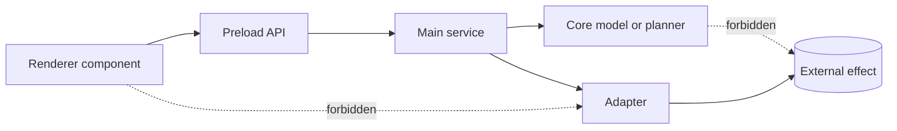

# Module boundaries

[Docs index](../README.md)

## At a glance

| Question | Answer |
| --- | --- |
| Physical ownership | Enforced for tracked source paths. |
| Import direction | Architectural rule with partial tooling coverage. |
| Renderer effects | Forbidden outside the preload API. |
| Core effects | Pure models and planners must remain effect-free. |
| Adapter role | Isolate external and Node-specific behavior. |

## Purpose

Small files do not create modularity by themselves. Crystal stays understandable only when dependencies move from UI intent toward controlled authority and pure logic, never sideways into convenient side effects.

## Current implementation

The source tree has registered owners for the desktop runtimes and core/shared/adapter packages. Feature validators guard high-risk shortcuts, while the source-tree validator rejects unregistered physical roots. There is not yet a complete linter for every import specifier, re-export, alias, or dynamic import.

## Key files

The following paths are the shortest reliable entry points. They are not a substitute for following the data flow through the subsystem.

## Key files and responsibilities

| File or path | Responsibility | Reads | Must not do |
| --- | --- | --- | --- |
| `apps/desktop/electron/renderer` | Browser UI and local interaction state. | shared contracts, pure core APIs, preload surface | import main or adapters |
| `apps/desktop/electron/preload` | Constrained bridge. | IPC constants and types | expose raw IPC |
| `apps/desktop/electron/main` | Privileged coordination. | core and adapters | own browser UI composition |
| `packages/core` | Portable model, validation, and planning logic. | plain inputs | use Electron or filesystem effects |
| `packages/adapters` | Effect implementations. | main-owned requests | hide product policy |

## Data flow

| Input | Decision | Output |
| --- | --- | --- |
| Renderer interaction | Is local state sufficient? | UI update or preload request |
| Main request | Which service owns the operation? | Validated state or adapter call |
| Core planner input | Can it remain pure? | Model or dry-run result |
| Adapter request | Which narrow effect is required? | Filesystem, watcher, compiler, or bundler result |

## Boundaries

A panel must not import privileged services. A core preview planner must not apply its own result. An adapter should not decide presentation or command policy. Physical ownership validation does not remove the need for architectural review.

> **Safety boundary:** State that crosses a boundary is evidence to validate, not authority to perform a privileged effect.

## What this does not do

| Not provided | Why |
| --- | --- |
| Complete dependency linter | Import-boundary coverage remains partial. |
| Execution authority in core previews | Preview and planning modules are pure. |
| Feature logic in shell primitives | Primitives remain presentational. |
| Unregistered source roots | Tracked paths outside policy fail validation. |

## Common misunderstanding

> **Common misunderstanding:** Modular means responsibilities and dependency direction are explicit. It does not mean any small module may import any other small module.

## Validation

Run `validate:source-tree-boundaries` for physical ownership and the focused feature validator for behavioral boundaries. Review new imports as part of the change.

## Related docs

- [Repository map](./repository-map.md)
- [Runtime boundaries](./runtime-boundaries.md)
- [Renderer shell](./renderer-shell/README.md)
- [Commands architecture](./commands/README.md)

## Future work

Add targeted import-boundary checks before write-capable flows, workers, WebGPU, or WASM create additional authority zones.
