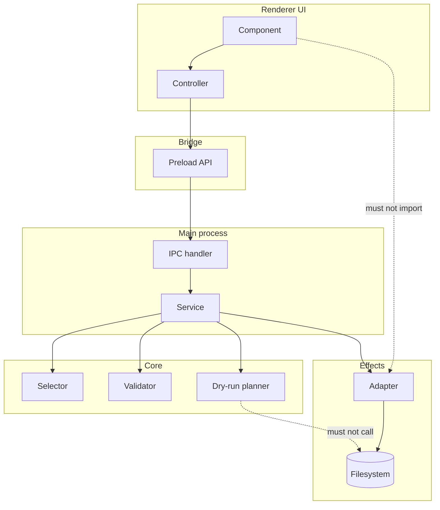

# Module Boundaries

[Docs index](../README.md)

## At a glance

| Question | Answer |
| --- | --- |
| Is this implemented? | Physical source ownership is enforced; import-direction enforcement remains partial. |
| Can UI modules import effects? | No. |
| Runtime owner | Renderer, main, core, adapters, and shared contracts each own different concerns. |
| Safety risk controlled | Prevents preview UI and dry-run modules from gaining side-effect authority. |
| Related next phase | Import-boundary validators before write-capable features. |

## Purpose

Crystal is intentionally modular, but modularity is only useful if dependencies point in predictable directions. This page explains which layers may know about each other and which shortcuts would make the system harder to secure, validate, or evolve.

## Why this exists

The project has many small modules. Without dependency rules, a panel can accidentally import a privileged service, or a core planner can quietly become an execution path.

## How to read this page

| Layer | Owns | Should avoid |
| --- | --- | --- |
| Renderer | UI, local interaction state, display formatting. | Filesystem, main services, patch application. |
| Preload | Controlled API exposure. | Raw IPC exposure. |
| Main | Privileged coordination and services. | Browser UI composition. |
| Core | Pure models, selectors, validators, dry-run planners. | Electron and filesystem effects. |
| Adapters | Effect isolation. | Business rules hidden from core. |

## Current implementation

Renderer components compose UI and hold only local interaction state. Core packages define portable models, validators, selectors, and planners. Main process modules coordinate Electron, filesystem, watcher, Preview protocol, and service state. Adapters isolate Node or external-tool effects.

| Implemented | Blocked | Future |
| --- | --- | --- |
| Registered physical owners for apps and packages. | Unregistered tracked source roots. | Import-boundary validation. |
| Modular renderer components. | UI importing filesystem adapters. | Static import graph enforcement. |
| Core command preview modules. | Preview modules writing files. | Separate execution runtime. |
| Shared IPC contracts. | Ad-hoc string channels. | Stronger ownership checks. |

## Key files

This list gives representative entry points for each layer. When changing a feature, follow the nearest path downward instead of reaching sideways into another runtime.

## Key files and responsibilities

| File or path | Responsibility | Reads | Must not do |
| --- | --- | --- | --- |
| `apps/desktop/electron/renderer/components/**` | Browser UI components. | Shared types, pure selectors, preload API. | Import main/adapters. |
| `apps/desktop/electron/main/ipc/register-project-ipc.ts` | Main IPC registration. | Shared channel contracts. | Expose untyped effects. |
| `packages/core/project/**` | Project models and selectors. | Source-independent model data. | Use Electron APIs. |
| `packages/core/commands/**` | Command preview contracts and planning. | Command/context state. | Write files. |
| `packages/adapters/file-system/file-system.adapter.ts` | Filesystem effect wrapper. | Main service calls. | Decide UI policy. |
| `packages/shared/**` | Cross-runtime contracts. | Types/constants. | Perform effects. |

## Data flow

| Input | Decision | Output |
| --- | --- | --- |
| UI interaction | Is this display-only or privileged? | Local state or preload call. |
| Main service request | Which core model or adapter owns it? | Sanitized state or issue. |
| Core planner input | Can it compute without side effects? | Preview result or blocked state. |
| Adapter call | Which effect is needed? | Filesystem/watcher result. |

## Main diagram

The diagram shows the intended dependency chain. Dotted arrows are forbidden shortcuts.

## Boundaries

`validate:source-tree-boundaries` enforces where tracked product source may live: `main`, `preload`, `renderer`, `core`, `shared`, and `adapters`, plus the exact desktop package metadata file. A UI panel must not import filesystem adapters, watcher adapters, protocol handlers, or Electron main services. Core command preview modules must not import renderer components. Source patch modules must not write files.

> **Implementation note:** Physical ownership validation does not inspect import specifiers, re-exports, aliases, or dynamic imports. Those import-boundary rules are still enforced by review and feature validators rather than a complete static import graph.

## What this does not do

| Not provided | Reason |
| --- | --- |
| Complete dependency linter | Future validation work. |
| Execution bus | Current command modules are preview-only. |
| Cross-runtime shortcuts | These would weaken security and testability. |

## Common misunderstanding

> **Common misunderstanding:** Modular does not mean any small file can import any other small file. Runtime direction still matters.

## Validation

`npm run validate:source-tree-boundaries` rejects tracked files outside the registered physical owners. Current feature validators focus on the highest-risk behavioral boundaries. Import-boundary validation is still future work, so reviewers should treat dependency direction as an architectural rule even where tooling is not yet exhaustive.

## Related docs

- [Repository map](./repository-map.md)
- [Runtime boundaries](./runtime-boundaries.md)
- [Command Preview Bus](./commands/command-preview-bus.md)
- [Future command execution](./commands/future-command-execution.md)

## Future work

Add explicit import-boundary checks for renderer-to-main imports, core-to-renderer leakage, adapter usage, and future worker/WASM/WebGPU modules before write-capable flows become normal UI.
