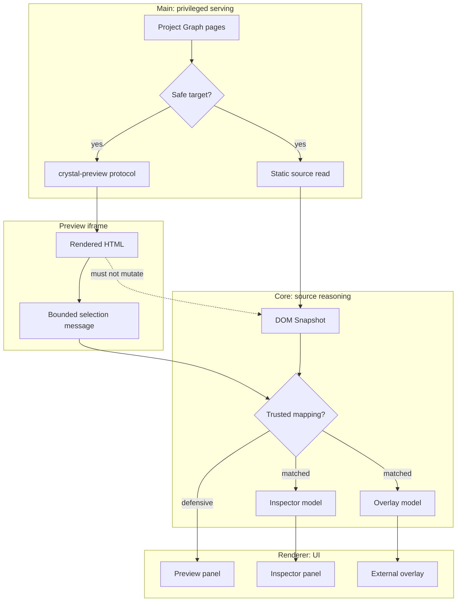

# Preview Architecture

[Docs index](../../README.md)

## At a glance

| Question | Answer |
| --- | --- |
| Is this implemented? | Yes, as a read-only Preview pipeline. |
| Can it write source files? | No. |
| Runtime owner | Main serves resources; renderer displays UI; core models snapshot, selection, inspector, and overlay state. |
| Safety risk controlled | Prevents project HTML from becoming a privileged editing surface. |
| Related next phase | Phase 6C refresh-boundary planning. |

> **Read this first:** Preview has two parallel views of the same page: Chromium renders it, while Crystal builds a static source-derived snapshot for reasoning.

## Purpose

Preview is where Crystal shows the user's real HTML, but it is not where Crystal grants editing authority. This page keeps the Preview pipeline split into serving, snapshotting, selecting, inspecting, and projecting overlays.

## Why this exists

A browser-rendered node and a source node are not automatically the same thing. Preview architecture exists to preserve that distinction before any future editing workflow can rely on selection.

## How to read this page

| Need | Read next |
| --- | --- |
| Safe file serving | [Project Preview](./project-preview.md) |
| Static source structure | [DOM Snapshot](./dom-snapshot.md) |
| Click-to-source reasoning | [Preview Selection](./preview-selection.md) |
| Visual highlight projection | [Visual Selection Overlay](./visual-selection-overlay.md) |
| Derived node details | [Preview Inspector](./preview-inspector.md) |

## Current implementation

The implemented Preview layer is a safe project-relative protocol plus renderer UI. It supports target selection, load/reload, diagnostics, static DOM Snapshot, read-only selection messages, conservative selection-to-snapshot mapping, Visual Selection Overlay, and Preview Inspector.

| Implemented | Blocked | Future |
| --- | --- | --- |
| Secure `crystal-preview://` serving. | File writes. | Refresh invalidation after future writes. |
| Static DOM Snapshot. | Live iframe DOM reads. | Stronger source mapping. |
| Read-only selection and Inspector. | Editable Inspector. | Hover and multi-select states. |
| External Visual Selection Overlay. | DOM mutation. | Layout guides and measurement overlays. |

## Key files

These paths divide the Preview system by responsibility. Main owns serving and source reads; core owns models and mapping; renderer owns display and iframe message handling.

## Key files and responsibilities

| File or path | Responsibility | Reads | Must not do |
| --- | --- | --- | --- |
| `apps/desktop/electron/main/preview/**` | Preview service and protocol. | Active root and Project Graph. | Serve outside-root files. |
| `apps/desktop/electron/main/dom/**` | DOM Snapshot source reads. | Active Preview target source. | Inspect live iframe DOM. |
| `packages/core/project/dom/**` | Static snapshot models and parser. | HTML source text. | Execute scripts. |
| `packages/core/project/preview-selection/**` | Selection state and mapping. | Bounded selected-node payload + snapshot. | Treat every click as writable. |
| `packages/core/project/preview-inspector/**` | Derived Inspector model. | Preview, selection, snapshot state. | Edit attributes or styles. |
| `packages/core/project/design-canvas/selection-overlay/**` | Overlay projection types. | Selection and canvas state. | Insert overlay nodes into user DOM. |

## Data flow

| Input | Decision | Output |
| --- | --- | --- |
| Project Graph page | Is it safe and inside the active root? | Preview target URL. |
| Active target source | Can it be parsed within limits? | DOM Snapshot state. |
| Iframe click summary | Can it map to snapshot? | Matched or defensive selection. |
| Matched selection | Can UI derive details or geometry? | Inspector and overlay state. |

## Main diagram

The diagram shows the two interpretations of the page. Solid lines are current read-only flows; dotted lines are explicitly blocked mutation shortcuts.

## Boundaries

Preview does not mutate files or DOM. Renderer does not receive absolute filesystem paths and does not read the iframe document. A selected visual node is not automatically writable because browser recovery, script execution, and static source parsing can diverge.

> **Safety boundary:** Preview may render project HTML, but it must not become the editor or a privileged source of truth.

## What this does not do

| Not provided | Reason |
| --- | --- |
| Real source editing | Write runtime is future-only. |
| Patch application | Command previews stay dry-run. |
| Live DOM inspection | Would weaken iframe isolation. |
| Computed styles / box model | Style Engine is future work. |

## Common misunderstanding

> **Common misunderstanding:** A selected iframe node is only a visual event until DOM Snapshot mapping confirms a source-derived target.

## Validation

`validate:preview`, `validate:dom-snapshot`, `validate:preview-selection`, `validate:preview-inspector`, and `validate:visual-selection-overlay` cover this subsystem.

## Related docs

- [Project Preview](./project-preview.md)
- [DOM Snapshot](./dom-snapshot.md)
- [Preview Selection](./preview-selection.md)
- [Visual Selection Overlay](./visual-selection-overlay.md)
- [Preview Inspector](./preview-inspector.md)
- [Preview safety](./preview-safety.md)

## Future work

Preview hardening should continue before writes are enabled. Phase 6C should define refresh-boundary planning so future source changes can invalidate graph, snapshot, selection, overlay, and iframe state deliberately rather than by accident.
