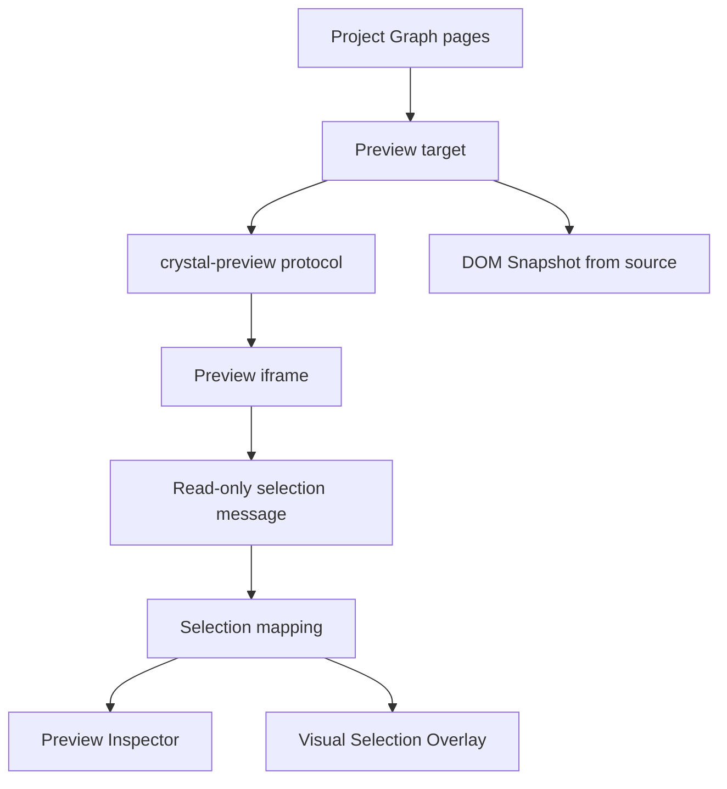

# Preview Architecture

[Docs index](../../README.md)

## Purpose

This document is the hub for Crystal's current Preview subsystem. It separates real Chromium rendering from static DOM Snapshot, read-only selection, overlay projection, and Inspector derivation.

## Current implementation

Preview is implemented as a safe project-relative protocol plus renderer UI. It supports target selection, load/reload, diagnostics, static DOM Snapshot, read-only selection messages, selection-to-snapshot mapping, Visual Selection Overlay, and Preview Inspector.

## Key files

- `packages/core/project/preview/**`
- `packages/core/project/dom/**`
- `packages/core/project/preview-selection/**`
- `packages/core/project/preview-inspector/**`
- `packages/core/project/design-canvas/selection-overlay/**`
- `apps/desktop/electron/main/preview/**`
- `apps/desktop/electron/main/dom/**`
- `apps/desktop/electron/main/preview-selection/**`
- `apps/desktop/electron/renderer/components/project-preview-panel/**`

## Data flow

Main resolves a preview target from Project Graph pages, serves it through the custom protocol, and reports sanitized issues. DOM Snapshot reads static HTML source. Preview Selection sends bounded messages from the iframe. Core mapping determines whether the selected live-preview node matches the static snapshot. Inspector and overlay render only from trusted or defensive derived state.

## Boundaries

Preview does not mutate project files. It does not expose absolute paths to renderer. It does not require same-origin iframe access. It does not allow renderer to read the live iframe DOM. It is not a browser DevTools replacement.

## Validation

`validate:preview`, `validate:dom-snapshot`, `validate:preview-selection`, `validate:preview-inspector`, and `validate:visual-selection-overlay` cover this subsystem.

## Related docs

- [Project Preview](./project-preview.md)
- [DOM Snapshot](./dom-snapshot.md)
- [Preview Selection](./preview-selection.md)
- [Visual Selection Overlay](./visual-selection-overlay.md)
- [Preview Inspector](./preview-inspector.md)
- [Preview safety](./preview-safety.md)

## Future work

Future Preview work should add better refresh boundaries and overlay hardening before write-capable editing. Browser console integration remains a later Developer Mode feature.
