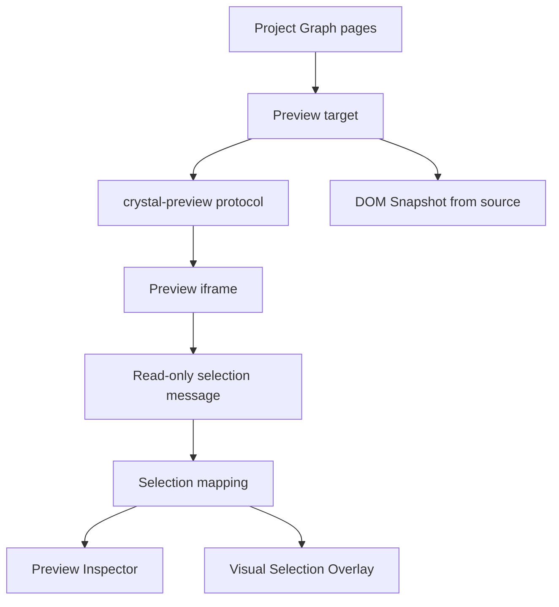

# Preview Architecture

[Docs index](../../README.md)

## Purpose

Preview is where Crystal shows the user's real HTML, but it is not where Crystal grants editing authority. This documentation keeps the Preview pipeline split into smaller responsibilities: serving project files safely, building a static source snapshot, reporting read-only selection, deriving inspection data, and projecting overlays outside the user document.

## Current implementation

The implemented Preview layer is a safe project-relative protocol plus renderer UI. It supports target selection, load/reload, diagnostics, static DOM Snapshot, read-only selection messages, conservative selection-to-snapshot mapping, Visual Selection Overlay, and Preview Inspector.

The diagram shows two parallel interpretations of the same target: Chromium renders the page in the iframe, while Crystal builds a source-derived snapshot for reasoning. Selection becomes useful only when those interpretations can be mapped safely.

## Key files

These paths divide the Preview system by responsibility. Main owns serving and source reads; core owns models and mapping; renderer owns display and iframe message handling.

- `packages/core/project/preview/**`
- `packages/core/project/dom/**`
- `packages/core/project/preview-selection/**`
- `packages/core/project/preview-inspector/**`
- `packages/core/project/design-canvas/selection-overlay/**`
- `apps/desktop/electron/main/preview/**`
- `apps/desktop/electron/main/dom/**`
- `apps/desktop/electron/main/preview-selection/**`
- `apps/desktop/electron/renderer/components/project-preview-panel/**`

## Data flow

Main resolves a target from Project Graph pages and serves it through `crystal-preview://`. DOM Snapshot reads the same target from static source. Preview Selection emits a bounded click summary from the iframe. Core mapping compares that visual identity to the snapshot. Inspector and overlay render derived states; they do not become authoritative project state.

## Boundaries

Preview does not mutate files or DOM. Renderer does not receive absolute filesystem paths and does not read the iframe document. A selected visual node is not automatically writable because browser recovery, script execution, and static source parsing can diverge.

## Validation

`validate:preview`, `validate:dom-snapshot`, `validate:preview-selection`, `validate:preview-inspector`, and `validate:visual-selection-overlay` cover this subsystem.

## Related docs

- [Project Preview](./project-preview.md)
- [DOM Snapshot](./dom-snapshot.md)
- [Preview Selection](./preview-selection.md)
- [Visual Selection Overlay](./visual-selection-overlay.md)
- [Preview Inspector](./preview-inspector.md)
- [Preview safety](./preview-safety.md)

## Future work

Preview hardening should continue before writes are enabled. Phase 6C should define refresh-boundary planning so future source changes can invalidate graph, snapshot, selection, overlay, and iframe state deliberately rather than by accident.
