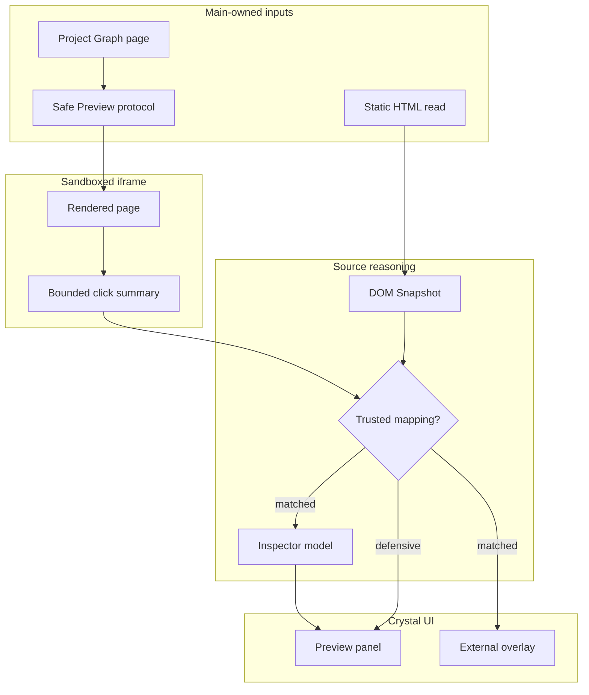

# Preview architecture

[Docs index](../../README.md)

## At a glance

| Question | Answer |
| --- | --- |
| Status | Implemented, read-only. |
| Browser owner | Chromium inside a sandboxed iframe. |
| Source owner | Main reads static source; core builds DOM Snapshot. |
| Selection | Bounded messages mapped defensively to snapshot state. |
| Mutation | Unavailable for both source and project DOM. |

## Purpose

Preview gives Crystal a real browser rendering while preserving a separate, source-derived model for reasoning. The subsystem is intentionally split because the page Chromium renders can diverge from the HTML Crystal reads.

## Current implementation

Main selects a safe project-relative target, serves resources through `crystal-preview://current/...`, and publishes sanitized Preview state. In parallel, main reads the active HTML source and core builds a bounded DOM Snapshot. The iframe can emit a limited selection summary when Select Mode is enabled. Renderer and main validate it, then core decides whether it maps to source-derived state. Inspector and overlay are consumers of that result.

## Key files

The following paths are the shortest reliable entry points. They are not a substitute for following the data flow through the subsystem.

## Key files and responsibilities

| File or path | Responsibility | Reads | Must not do |
| --- | --- | --- | --- |
| `apps/desktop/electron/main/preview` | Preview service and protocol. | active project root and graph | serve outside-root files |
| `apps/desktop/electron/main/dom` | Static HTML source reads for Snapshot. | active target | read iframe DOM |
| `packages/core/project/dom` | Snapshot parser and models. | HTML text | execute scripts |
| `packages/core/project/preview-selection` | Selection state and mapping. | bounded messages and Snapshot | promote ambiguity to trust |
| `packages/core/project/preview-inspector` | Derived Inspector model. | Preview, selection, and Snapshot | create editing authority |

## Data flow

| Input | Decision | Output |
| --- | --- | --- |
| Project Graph page | Is it a safe active-root target? | Preview URL or issue |
| HTML source | Can it be parsed within limits? | DOM Snapshot and issues |
| Iframe click | Is the payload bounded and expected? | Selection candidate or ignored message |
| Selection candidate | Does Snapshot confirm identity? | Matched or defensive mapping |
| Matched state | Can geometry and details be derived? | Inspector and external overlay |

## Boundaries

The browser-rendered page and DOM Snapshot are parallel interpretations. Crystal does not read live iframe internals to reconcile them. Selection is read-only evidence, the overlay belongs to Crystal UI, and Preview does not own project persistence.

> **Safety boundary:** State that crosses a boundary is evidence to validate, not authority to perform a privileged effect.

## What this does not do

| Not provided | Why |
| --- | --- |
| Source editing | No write runtime or patch application exists. |
| Live iframe DOM inspection | Isolation is preserved through bounded messages. |
| Browser style truth | No computed styles, CSSOM, or real cascade is read. |
| Trusted mapping on ambiguity | Defensive states remain visible. |

## Common misunderstanding

> **Common misunderstanding:** Preview is not the editor surface. It is the rendered half of a read-only pipeline whose source authority remains outside the iframe.

## Validation

Run `validate:preview`, `validate:dom-snapshot`, `validate:preview-selection`, `validate:preview-inspector`, and `validate:visual-selection-overlay` when changing this pipeline.

## Related docs

- [Project Preview](./project-preview.md)
- [DOM Snapshot](./dom-snapshot.md)
- [Preview Selection](./preview-selection.md)
- [Preview safety](./preview-safety.md)
- [Commands architecture](../commands/README.md)

## Future work

Improve source mapping, lifecycle invalidation, hover/multi-select states, and overlay projection without relaxing iframe isolation. Future writes must refresh every derived state explicitly.

## Read next

You are here: Preview Pipeline.

Before this:
- [Architecture overview](../README.md) places Preview between main-owned serving and renderer presentation.

Next:
- [Project Preview](./project-preview.md) explains safe project-relative serving.
- [DOM Snapshot](./dom-snapshot.md) explains the source-derived structural model.

Why this matters:
Preview is where untrusted project code and trusted desktop capability come closest. Understanding the two-model design prevents convenience changes from collapsing that boundary.
