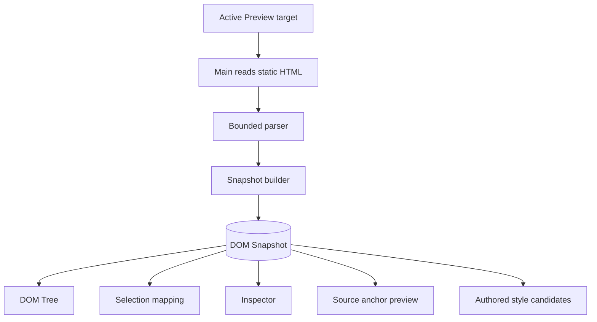

# DOM Snapshot

[Docs index](../../README.md)

## At a glance

| Question | Answer |
| --- | --- |
| Status | Implemented, read-only. |
| Input | Static HTML source for the active Preview target. |
| Output | Bounded tree, source locations where available, and parser issues. |
| Browser relation | Parallel model, not the live DOM. |
| Writes | None. |

## Purpose

Crystal needs a structural model tied to source, but the iframe DOM is runtime output shaped by browser recovery and scripts. DOM Snapshot provides a bounded source-derived tree for reasoning without granting live-DOM authority.

## Current implementation

Main reads the active HTML file and passes text to the core parser/builder. The snapshot records document and element nodes, structural paths, tag names, attributes, bounded text previews, depth, sibling indexes, source locations when available, truncation state, and issues. Consumers include DOM Tree, selection mapping, Inspector, source anchors, and authored-style matching.

## Key files

The following paths are the shortest reliable entry points. They are not a substitute for following the data flow through the subsystem.

## Key files and responsibilities

| File or path | Responsibility | Reads | Must not do |
| --- | --- | --- | --- |
| `packages/core/project/dom/project-dom-snapshot.types.ts` | Defines snapshot state and node contracts. | plain source-derived data | encode live browser objects |
| `packages/core/project/dom/project-dom-snapshot-parser.ts` | Tokenizes and parses bounded HTML. | source text | execute scripts |
| `packages/core/project/dom/project-dom-snapshot-builder.ts` | Builds structural nodes and paths. | parser records | write source |
| `apps/desktop/electron/main/dom/project-dom-snapshot-service.ts` | Reads active target source and publishes state. | Preview target | inspect iframe DOM |
| `project-dom-tree-panel.ts` | Displays snapshot structure. | sanitized snapshot state | mutate model or source |

## Data flow

| Input | Decision | Output |
| --- | --- | --- |
| Active Preview target | Can main read its static HTML? | Source text or sanitized issue |
| Source text | Can the bounded parser complete? | Snapshot tree and parser issues |
| Snapshot node | Is source location available? | Eligible source anchor or blocked state |
| Parser limit | Was traversal truncated? | Explicit truncation metadata |

## Boundaries

DOM Snapshot is not a browser-grade DOM. It does not execute scripts, calculate layout, inspect styles, reproduce every recovery rule, or guarantee a writable identity for a rendered node. Missing source location is a reason to block source planning.

> **Safety boundary:** State that crosses a boundary is evidence to validate, not authority to perform a privileged effect.

## What this does not do

| Not provided | Why |
| --- | --- |
| Live synchronization | Runtime DOM changes are not mirrored into the snapshot. |
| CSS cascade or box model | The snapshot contains structure, not browser style/layout truth. |
| Source mutation | Consumers receive read-only model data. |
| Guaranteed exact ranges | Locations exist only where the bounded parser can provide them. |

## Common misunderstanding

> **Common misunderstanding:** A snapshot path is a coordinate inside one source-derived traversal. It is not a permanent ID and not an editable `Element`.

## Validation

`npm run validate:dom-snapshot` covers parser behavior, limits, node paths, source locations, issues, truncation, and read-only consumers.

## Related docs

- [Preview architecture](./README.md)
- [Preview Selection](./preview-selection.md)
- [DOM Snapshot flow](../flows/dom-snapshot-flow.md)
- [Authored Style Matching](../authored-style-matching-dom-snapshot.md)

## Future work

Source mapping can become more precise while preserving bounded plain-data contracts. Worker or WASM acceleration should prove a benefit before replacing the TypeScript path.
