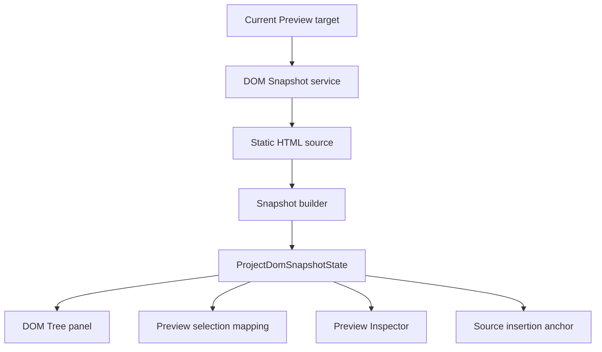

# DOM Snapshot

[Docs index](../../README.md)

## Purpose

DOM Snapshot gives Crystal a source-derived structure to reason about without trusting or inspecting the live iframe DOM. It is the static counterpart to the rendered Preview: less visually faithful than Chromium, but safer and more stable for mapping, inspection, and future source planning.

## Current implementation

The snapshot service reads the active Preview target's static HTML source and builds a bounded tree. Nodes include structural paths, tag names, attributes, text previews, depth, sibling indexes, source locations when available, and parser issues. The result supports DOM Tree rendering, Selection mapping, Preview Inspector, and Source Patch Preview anchors.

The diagram shows that all consumers read snapshot state; none of them re-read the source or ask the iframe for live DOM access.

## Key files

Read the types first, then the builder/parser, then the main service and renderer panel.

- `packages/core/project/dom/project-dom-snapshot.types.ts`
- `packages/core/project/dom/project-dom-snapshot-state.ts`
- `packages/core/project/dom/project-dom-snapshot-builder.ts`
- `packages/core/project/dom/project-dom-snapshot-parser.ts`
- `apps/desktop/electron/main/dom/project-dom-snapshot-service.ts`
- `apps/desktop/electron/renderer/components/project-dom-tree-panel/project-dom-tree-panel.ts`
- `scripts/validate-dom-snapshot.mjs`

## Data flow

Renderer requests a build. Main reads the active Preview target source. Core parses and serializes the bounded tree. Main emits sanitized snapshot state. DOM Tree, Selection mapping, Preview Inspector, and Source Patch Preview consume that state.

## Boundaries

DOM Snapshot is not a browser-grade DOM. It does not execute scripts, resolve runtime framework state, compute layout, inspect styles, or guarantee every browser recovery rule. A snapshot path is a structural coordinate in the serialized source model, not a CSS selector and not proof that a live node is writable.

## Validation

`validate:dom-snapshot` checks parser behavior, limits, path stability, issue handling, and the read-only DOM Tree contract.

## Related docs

- [Preview Selection](./preview-selection.md)
- [Preview Inspector](./preview-inspector.md)
- [Source Patch Preview](../commands/source-patch-preview.md)
- [DOM Snapshot flow](../flows/dom-snapshot-flow.md)

## Future work

Future source mapping can become more precise, but it should remain bounded and source-derived. Worker or WASM acceleration should preserve the same state contract before replacing TypeScript parsing paths.
