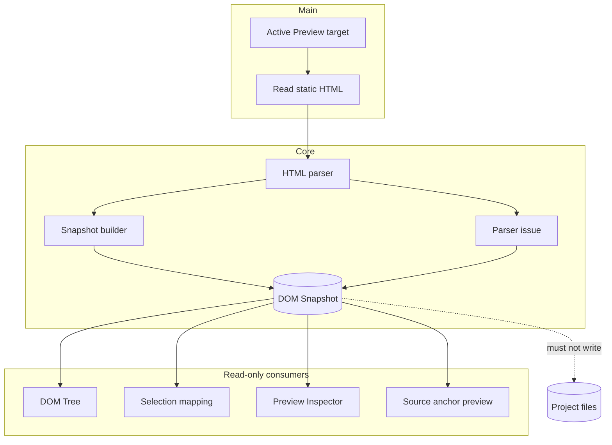

# DOM Snapshot

[Docs index](../../README.md)

## At a glance

| Question | Answer |
| --- | --- |
| Is this implemented? | Yes, as a bounded static source snapshot. |
| Can it write source files? | No. |
| Runtime owner | Main reads source; core parses and models snapshot state. |
| Safety risk controlled | Avoids trusting or inspecting the live iframe DOM. |
| Related next phase | Better source mapping before writes. |

## Purpose

DOM Snapshot gives Crystal a source-derived structure to reason about without trusting or inspecting the live iframe DOM. It is the static counterpart to the rendered Preview.

## Why this exists

Rendered DOM may include browser recovery and runtime mutations. Source planning needs a safer static model with explicit limits and issues.

## How to read this page

| Need | Focus |
| --- | --- |
| Snapshot shape | Key files and data flow. |
| Selection mapping | Data flow and related docs. |
| Parser limits | Boundaries and blocked states. |

## Current implementation

The snapshot service reads the active Preview target's static HTML source and builds a bounded tree. Nodes include structural paths, tag names, attributes, text previews, depth, sibling indexes, source locations when available, and parser issues.

| Implemented | Blocked | Future |
| --- | --- | --- |
| Static tree from source. | Script execution. | More precise source ranges. |
| Source locations where available. | Computed layout/style. | Worker/WASM parsing if contract stays stable. |
| Parser issues and truncation. | Live iframe DOM reads. | Richer mapping diagnostics. |

## Key files

Read the types first, then the builder/parser, then the main service and renderer panel.

## Key files and responsibilities

| File | Responsibility | Reads | Must not do |
| --- | --- | --- | --- |
| `packages/core/project/dom/project-dom-snapshot.types.ts` | Snapshot contracts. | Static model fields. | Encode browser runtime state. |
| `packages/core/project/dom/project-dom-snapshot-builder.ts` | Builds bounded snapshot tree. | Parsed source. | Write files. |
| `packages/core/project/dom/project-dom-snapshot-parser.ts` | Parses HTML source. | HTML text. | Execute scripts. |
| `apps/desktop/electron/main/dom/project-dom-snapshot-service.ts` | Reads source and emits state. | Active Preview target. | Read iframe DOM. |
| `apps/desktop/electron/renderer/components/project-dom-tree-panel/project-dom-tree-panel.ts` | Displays tree state. | Snapshot state. | Mutate snapshot/source. |

## Data flow

| Input | Decision | Output |
| --- | --- | --- |
| Current Preview target | Is source readable? | Source text or issue. |
| Source text | Can parser build bounded structure? | Snapshot tree + issues. |
| Snapshot node | Does it have source location? | Eligible anchor or blocked preview. |
| Parser limit | Was tree truncated? | Explicit truncation state. |

## Main diagram

## Boundaries

DOM Snapshot is not a browser-grade DOM. It does not execute scripts, resolve runtime framework state, compute layout, inspect styles, or guarantee every browser recovery rule.

> **Safety boundary:** Snapshot paths are structural coordinates in a source-derived model, not proof that a live browser node is writable.

## What this does not do

| Not provided | Reason |
| --- | --- |
| Live DOM sync | Would require trusting runtime DOM. |
| CSS cascade/box model | Style Engine is future work. |
| Source mutation | Snapshot is read-only input to planning. |

## Common misunderstanding

> **Common misunderstanding:** DOM Snapshot is not the same object model Chromium uses after scripts and browser recovery run.

## Validation

`validate:dom-snapshot` checks parser behavior, limits, path stability, issue handling, and the read-only DOM Tree contract.

## Related docs

- [Preview Selection](./preview-selection.md)
- [Preview Inspector](./preview-inspector.md)
- [Source Patch Preview](../commands/source-patch-preview.md)
- [DOM Snapshot flow](../flows/dom-snapshot-flow.md)

## Future work

Future source mapping can become more precise, but it should remain bounded and source-derived. Worker or WASM acceleration should preserve the same state contract before replacing TypeScript parsing paths.
