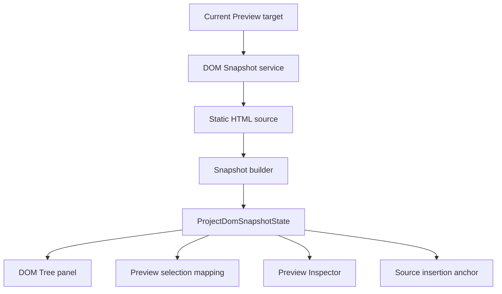

# DOM Snapshot

[Docs index](../../README.md)

## Purpose

This document describes the static DOM Snapshot layer used by Selection mapping, Preview Inspector, DOM Tree, and Source Patch Preview anchors.

## Current implementation

DOM Snapshot reads the static HTML source of the active Preview target. It builds a bounded structural tree with deterministic `snapshotPath` values, attributes, text previews, source locations where available, and controlled parser issues. It is not a live browser DOM mirror.

## Key files

- `packages/core/project/dom/project-dom-snapshot.types.ts`
- `packages/core/project/dom/project-dom-snapshot-state.ts`
- `packages/core/project/dom/project-dom-snapshot-builder.ts`
- `packages/core/project/dom/project-dom-snapshot-parser.ts`
- `apps/desktop/electron/main/dom/project-dom-snapshot-service.ts`
- `apps/desktop/electron/renderer/components/project-dom-tree-panel/project-dom-tree-panel.ts`
- `scripts/validate-dom-snapshot.mjs`

## Data flow

Renderer requests a snapshot build. Main reads only the active Preview target source. Core parses and serializes a bounded tree. Main stores and emits sanitized snapshot state. Renderer DOM Tree, Preview Inspector, Selection mapping, and Source Patch Preview consume that state.

## Boundaries

DOM Snapshot does not execute scripts, compute layout, inspect runtime DOM, follow framework component state, or guarantee browser-equivalent error recovery. Snapshot paths are structural coordinates, not CSS selectors. Snapshot state is read-only.

## Validation

`validate:dom-snapshot` checks parser behavior, limits, path stability, issue handling, and read-only DOM Tree assumptions.

## Related docs

- [Preview Selection](./preview-selection.md)
- [Preview Inspector](./preview-inspector.md)
- [Source Patch Preview](../commands/source-patch-preview.md)
- [DOM Snapshot flow](../flows/dom-snapshot-flow.md)

## Future work

Future work may add richer source mapping, framework-aware analysis, or worker/WASM acceleration. Those enhancements must preserve bounded output and must not depend on live iframe DOM reads.
