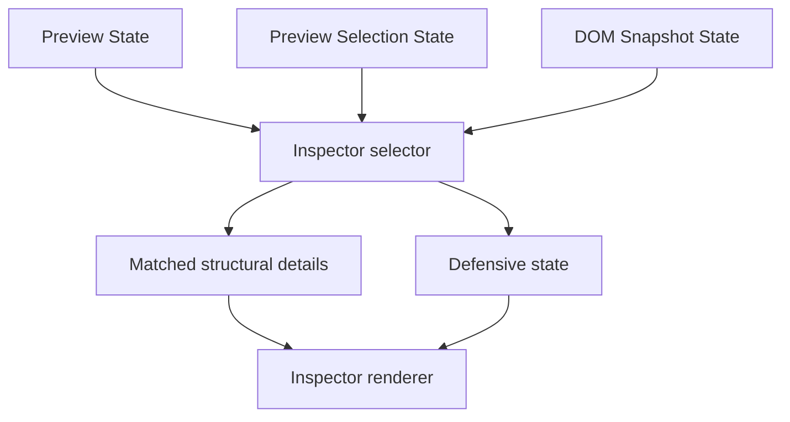

# Preview Inspector

[Docs index](../../README.md)

## Purpose

Preview Inspector explains the selected target without pretending that Crystal can edit it yet. It is the place where Selection, Preview, and DOM Snapshot state are reconciled into a human-readable structural view.

## Current implementation

The Inspector is derived state. Core receives Preview state, Preview Selection state, and DOM Snapshot state, then returns either trusted structural details for a matched node or a defensive explanation. Renderer turns that model into a compact read-only panel.

The diagram separates inputs from output. There is no independent Inspector authority that can override mapping results.

## Key files

Start in the selector to understand the decision model, then read the renderer for presentation details.

- `packages/core/project/preview-inspector/project-preview-inspector.types.ts`
- `packages/core/project/preview-inspector/project-preview-inspector-selector.ts`
- `apps/desktop/electron/renderer/components/project-preview-panel/inspector/project-preview-inspector-renderer.ts`
- `apps/desktop/electron/renderer/components/project-preview-panel/project-preview-panel.ts`
- `scripts/validate-preview-inspector.mjs`

## Data flow

A matched mapping allows the Inspector to show snapshot node data such as tag, path, depth, attributes, text preview, source location, child count, and truncation state. Missing snapshot, stale snapshot, mismatch, ambiguity, or internal inconsistency produces a defensive state so the UI does not invent source truth.

## Boundaries

The current Inspector is not the future editable Inspector. It cannot edit attributes, text, classes, CSS, computed styles, layout, box model, or source files. It cannot scroll the DOM Tree or query the live iframe document.

## Validation

`validate:preview-inspector` checks model states, renderer sections, read-only UI constraints, and forbidden editing affordances.

## Related docs

- [Preview Selection](./preview-selection.md)
- [DOM Snapshot](./dom-snapshot.md)
- [Preview safety](./preview-safety.md)
- [Roadmap implementation](../../roadmap-implementation.md)

## Future work

Editable Inspector work needs command-backed mutations, class and CSS/Sass source ownership, undo/redo records, dirty-state tracking, and write validation before controls can become active.
