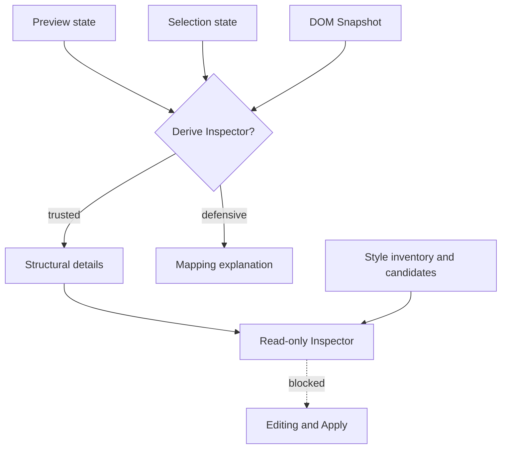

# Preview Inspector

[Docs index](../../README.md)

## At a glance

| Question | Answer |
| --- | --- |
| Status | Implemented, read-only. |
| Source of truth | Derived from Preview, selection, and DOM Snapshot state. |
| Trusted output | Structural details for a matched node. |
| Defensive output | Explicit reason when mapping cannot be trusted. |
| Editing | Unavailable. |

## Purpose

Selection without an explanation is difficult to trust. Preview Inspector turns current Preview, Snapshot, and mapping state into readable structural context while keeping edit controls outside the current authority model.

## Current implementation

Core derives an Inspector view model rather than letting renderer infer source facts. A matched selection may expose tag, attributes, snapshot path, depth, source location, and bounded text preview. Missing target, no selection, stale load, mismatch, ambiguity, or unavailable source data produce defensive panels. The later Editable Inspector surface remains disabled and read-only.

## Key files

The following paths are the shortest reliable entry points. They are not a substitute for following the data flow through the subsystem.

## Key files and responsibilities

| File or path | Responsibility | Reads | Must not do |
| --- | --- | --- | --- |
| `project-preview-inspector.types.ts` | Defines Inspector states and sections. | Preview and Snapshot contracts | encode write effects |
| `project-preview-inspector-selector.ts` | Derives trusted or defensive view model. | Preview, selection, Snapshot | invent source details |
| `project-preview-inspector-renderer.ts` | Renders structural sections. | Inspector view model | add editable controls |
| `views/inspector/editable-inspector` | Shows disabled future drafts. | readiness and field previews | attach Apply handlers |
| `views/inspector/css-sass-inspector` | Shows read-only style inventory and candidates. | plain style preview data | read CSSOM or computed styles |

## Data flow

| Input | Decision | Output |
| --- | --- | --- |
| Preview state | Is a target ready? | Context or unavailable state |
| Selection state | Is a selected node present? | Identity hint or empty state |
| Mapping status | Is the match trusted? | Snapshot lookup or defensive explanation |
| Snapshot node | Which source-derived fields exist? | Structural Inspector sections |
| Style previews | Are inventory/candidates available? | Read-only style sections |

## Boundaries

Showing a value does not make it editable. Inspector cannot override mapping status, mutate source, access the live iframe DOM, calculate the real cascade, read computed styles, or enable Apply.

> **Safety boundary:** State that crosses a boundary is evidence to validate, not authority to perform a privileged effect.

## What this does not do

| Not provided | Why |
| --- | --- |
| Editable attributes or text | Current field drafts are disabled presentation. |
| Class and style mutation | No write runtime or Apply flow. |
| Live box model | No live iframe inspection or computed-style reads. |
| Guaranteed source line | Only available parser locations are shown. |

## Common misunderstanding

> **Common misunderstanding:** The read-only Inspector, disabled Editable Inspector, and CSS/Sass candidate surface are different views over evidence. None of them is a persistence layer.

## Validation

Use `validate:preview-inspector`, `validate:editable-inspector-surface`, `validate:css-sass-inspector-surface`, and `validate:authored-style-matching` for the relevant sections.

## Related docs

- [Preview Selection](./preview-selection.md)
- [DOM Snapshot](./dom-snapshot.md)
- [CSS/Sass Inspector surface](../css-sass-inspector-readonly-surface.md)
- [Implementation status](../../roadmap-implementation.md)

## Future work

Enabled Inspector fields require command-backed mutation, source conflict handling, transaction history, dirty state, refresh execution, and honest Apply UX. Style editing additionally requires source ownership and browser-style correlation.
