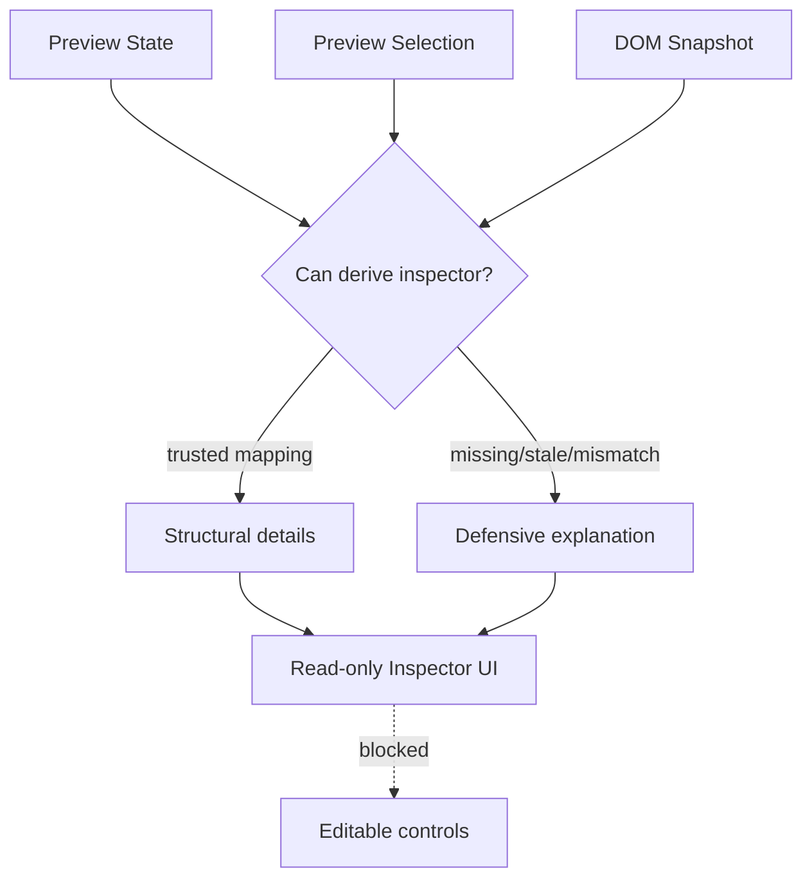

# Preview Inspector

[Docs index](../../README.md)

## At a glance

| Question | Answer |
| --- | --- |
| Is this implemented? | Yes, as a read-only derived panel. |
| Can it write source files? | No. |
| Runtime owner | Core derives Inspector model; renderer displays it. |
| Safety risk controlled | Prevents selected-node details from becoming editable controls. |
| Related next phase | Future editable Inspector requires command-backed writes. |

## Purpose

Preview Inspector explains the selected target without pretending that Crystal can edit it yet. It reconciles Selection, Preview, and DOM Snapshot state into a human-readable structural view.

## Why this exists

Selection without explanation is hard to debug. Inspector makes mapping confidence visible while keeping editing unavailable.

## How to read this page

| Need | Focus |
| --- | --- |
| Trusted details | Data flow. |
| Defensive states | Common misunderstanding and boundaries. |
| Future editing | What this does not do. |

## Current implementation

The Inspector is derived state. Core receives Preview state, Preview Selection state, and DOM Snapshot state, then returns either trusted structural details for a matched node or a defensive explanation.

| Implemented | Blocked | Future |
| --- | --- | --- |
| Structural snapshot details. | Attribute/text editing. | Editable fields with transactions. |
| Defensive mapping explanations. | CSS/style editing. | Box model and computed styles. |
| Read-only renderer panel. | DOM Tree navigation. | Scroll-to-node after safe mapping. |

## Key files

Start in the selector to understand the decision model, then read the renderer for presentation details.

## Key files and responsibilities

| File | Responsibility | Reads | Must not do |
| --- | --- | --- | --- |
| `project-preview-inspector.types.ts` | Inspector model contract. | Preview/snapshot types. | Encode edit commands. |
| `project-preview-inspector-selector.ts` | Derives matched or defensive model. | Preview, selection, snapshot state. | Invent trusted source details. |
| `project-preview-inspector-renderer.ts` | Renders read-only panel. | Inspector model. | Add editable controls. |
| `project-preview-panel.ts` | Hosts Inspector in Preview UI. | Preview panel state. | Mutate source. |

## Data flow

| Input | Decision | Output |
| --- | --- | --- |
| Preview state | Is a target loaded? | Context for Inspector. |
| Selection state | Is there a selected node? | Selected identity or empty state. |
| Mapping state | Is snapshot match trusted? | Structural details or defensive explanation. |
| Snapshot node | What source-derived data exists? | Attributes, path, depth, location, text preview. |

## Main diagram

## Boundaries

The current Inspector is not the future editable Inspector. It cannot edit attributes, text, classes, CSS, computed styles, layout, box model, or source files.

> **Safety boundary:** Inspector can explain mapping state, but it cannot override it.

## What this does not do

| Not provided | Reason |
| --- | --- |
| Editable attributes/text/classes | Requires command execution and undo. |
| Computed style inspection | Style Engine is future. |
| Source mutation | No write runtime. |
| Scroll-to-node | Not implemented in current Inspector. |

## Common misunderstanding

> **Common misunderstanding:** Showing an attribute in Inspector is not the same as owning an editable attribute model.

## Validation

`validate:preview-inspector` checks model states, renderer sections, read-only UI constraints, and forbidden editing affordances.

## Related docs

- [Preview Selection](./preview-selection.md)
- [DOM Snapshot](./dom-snapshot.md)
- [Preview safety](./preview-safety.md)
- [Roadmap implementation](../../roadmap-implementation.md)

## Future work

Editable Inspector work needs command-backed mutations, class and CSS/Sass source ownership, undo/redo records, dirty-state tracking, and write validation before controls can become active.
