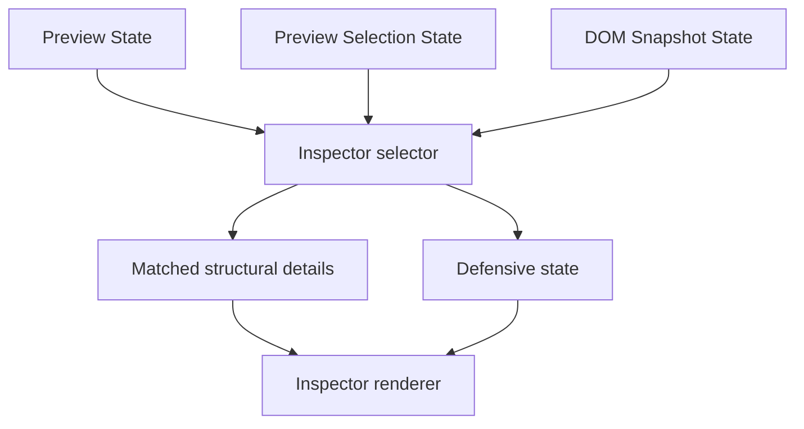

# Preview Inspector

[Docs index](../../README.md)

## Purpose

This document describes the current Preview Inspector as a derived, read-only structural panel.

## Current implementation

Preview Inspector consumes Preview state, Preview Selection state, and DOM Snapshot state. Core resolves an Inspector view model. Renderer renders structural selected-node and matched snapshot details. It does not expose editable attributes, computed styles, box model, CSS rules, or source mutation.

## Key files

- `packages/core/project/preview-inspector/project-preview-inspector.types.ts`
- `packages/core/project/preview-inspector/project-preview-inspector-selector.ts`
- `apps/desktop/electron/renderer/components/project-preview-panel/inspector/project-preview-inspector-renderer.ts`
- `apps/desktop/electron/renderer/components/project-preview-panel/project-preview-panel.ts`
- `scripts/validate-preview-inspector.mjs`

## Data flow

When selection or snapshot state changes, renderer re-derives the Inspector model. A trusted `matched` mapping yields snapshot node details. Missing, stale, mismatched, ambiguous, or internally inconsistent states render defensive messages without fabricating source truth.

## Boundaries

Preview Inspector is not the future editable Inspector MVP. It cannot edit attributes, text, classes, CSS, computed style, layout, box model, or source files. It cannot scroll the DOM Tree or query the live iframe document.

## Validation

`validate:preview-inspector` checks model states, renderer sections, read-only UI constraints, and forbidden editing affordances.

## Related docs

- [Preview Selection](./preview-selection.md)
- [DOM Snapshot](./dom-snapshot.md)
- [Preview safety](./preview-safety.md)
- [Roadmap implementation](../../roadmap-implementation.md)

## Future work

Editable Inspector work remains Future. It needs command-backed mutations, CSS/Sass source ownership, class management, undo/redo, and write validation before controls become active.
