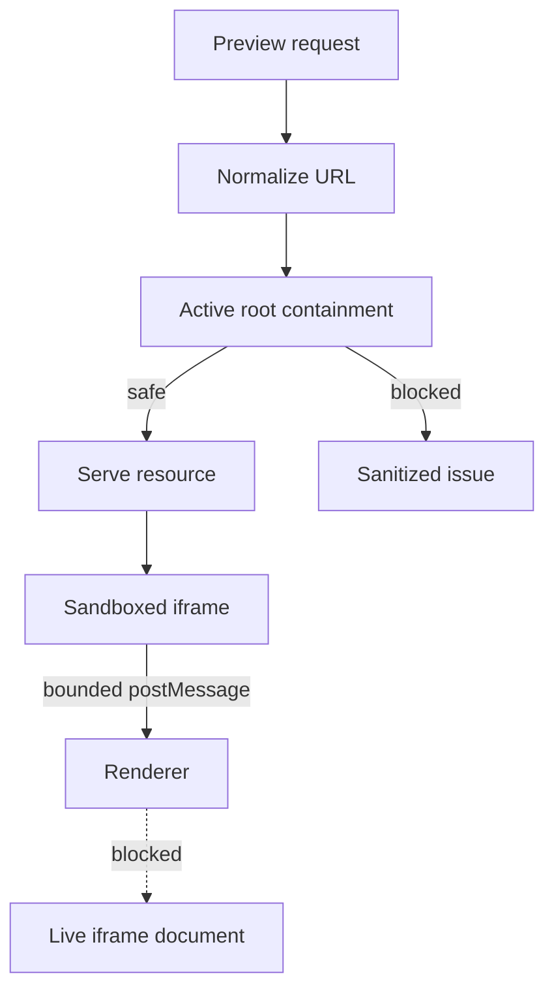

# Preview Safety

[Docs index](../../README.md)

## Purpose

Preview safety collects the rules that let Crystal show a real web page without trusting it. A loaded page can run its own scripts, recover malformed HTML differently than the static parser, and request local or external assets. Crystal must observe those behaviors without granting them desktop authority.

## Current implementation

Safety is layered. BrowserWindow preferences keep renderer privileges low. The custom Preview protocol constrains file serving to the active project root. Preview issues are sanitized before they reach renderer. DOM Snapshot reads static source instead of iframe internals. The selection script is inactive by default and emits bounded messages only.

The diagram shows the request gate: a resource is served only after normalization and root containment checks. Selection data uses a separate bounded path back to renderer.

## Key files

Read these files when changing Preview serving, sandboxing, snapshot source reads, or selection messaging.

- `apps/desktop/electron/main/security/web-preferences.ts`
- `apps/desktop/electron/main/preview/project-preview-protocol.ts`
- `packages/core/project/preview/project-preview-issues.ts`
- `packages/core/project/dom/project-dom-snapshot-parser.ts`
- `packages/core/project/preview-selection/project-preview-selection-validators.ts`
- `apps/desktop/electron/renderer/components/project-preview-panel/selection/project-preview-selection-message-bridge.ts`

## Data flow

Iframe resource requests enter the protocol handler and become either served bytes or sanitized issues. DOM Snapshot source reads happen through main using the active target. Selection events return to renderer as bounded summaries and are validated before they affect application state.

## Boundaries

Do not add `allow-same-origin` to make iframe access easier. Do not read `iframe.contentDocument` or `iframe.contentWindow.document`. Do not use `insertAdjacentHTML`, `contenteditable`, or `execCommand` as editing shortcuts. Do not expose absolute project paths in renderer diagnostics. Each rule prevents a specific class of bug: privilege escalation, DOM contamination, source drift, or path disclosure.

## Validation

Preview safety is covered by `validate:preview`, `validate:dom-snapshot`, `validate:preview-selection`, `validate:preview-inspector`, and `validate:source-patch-preview`.

## Related docs

- [Security model](../security-model.md)
- [Project Preview](./project-preview.md)
- [Preview Selection](./preview-selection.md)
- [Security boundaries diagram](../diagrams/security-boundaries.md)

## Future work

Write-capable features must add source validation, command policy, undo/redo transactions, refresh planning, and explicit save/apply behavior. They should not remove existing Preview isolation to gain convenience.
