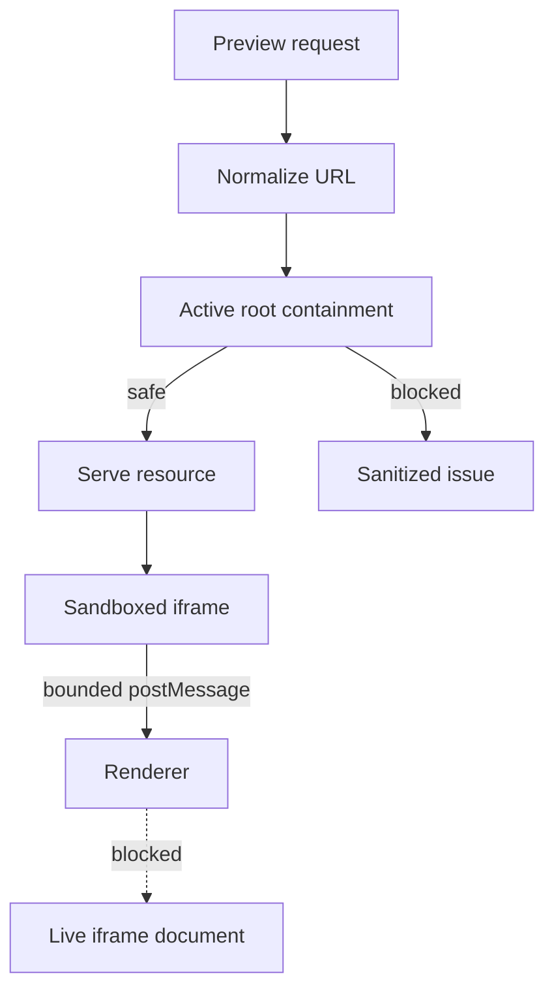

# Preview Safety

[Docs index](../../README.md)

## Purpose

This document collects the safety rules for loading, observing, selecting, and inspecting project HTML inside Crystal.

## Current implementation

Preview safety is built from multiple layers: Electron security preferences, custom protocol path checks, sanitized Preview issues, bounded DOM Snapshot parsing, inactive-by-default selection injection, iframe message validation, and renderer avoidance of live iframe DOM reads.

## Key files

- `apps/desktop/electron/main/security/web-preferences.ts`
- `apps/desktop/electron/main/preview/project-preview-protocol.ts`
- `packages/core/project/preview/project-preview-issues.ts`
- `packages/core/project/dom/project-dom-snapshot-parser.ts`
- `packages/core/project/preview-selection/project-preview-selection-validators.ts`
- `apps/desktop/electron/renderer/components/project-preview-panel/selection/project-preview-selection-message-bridge.ts`

## Data flow

Project HTML is served only through the active preview protocol. Resource failures produce sanitized issues. DOM Snapshot reads source from the active target, not from iframe runtime. Selection messages carry bounded metadata and pass renderer/main validation.

## Boundaries

Do not add `allow-same-origin` to simplify selection. Do not read `iframe.contentDocument`. Do not call `iframe.contentWindow.document`. Do not use `insertAdjacentHTML`, `contenteditable`, or `execCommand` for feature shortcuts. Do not expose raw project paths to renderer UI.

## Validation

Preview safety is covered by `validate:preview`, `validate:dom-snapshot`, `validate:preview-selection`, `validate:preview-inspector`, and `validate:source-patch-preview`.

## Related docs

- [Security model](../security-model.md)
- [Project Preview](./project-preview.md)
- [Preview Selection](./preview-selection.md)
- [Security boundaries diagram](../diagrams/security-boundaries.md)

## Future work

Future write features must add more safety layers, not remove existing ones. Safe writes require source patch validation, command execution policy, undo/redo transactions, refresh planning, and explicit save/apply workflow.
