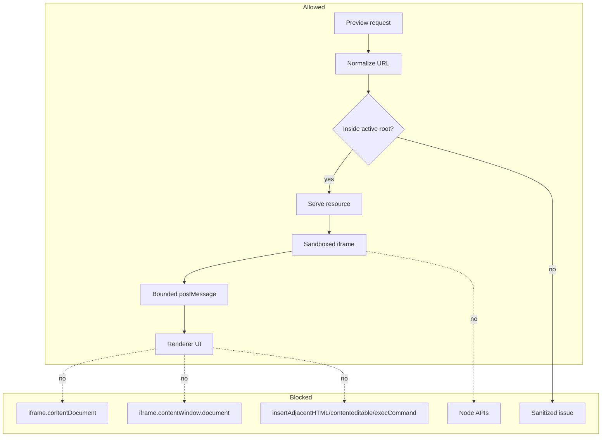

# Preview Safety

[Docs index](../../README.md)

## At a glance

| Question | Answer |
| --- | --- |
| Is this implemented? | Yes, through layered Preview and Electron restrictions. |
| Can Preview bypass security for convenience? | No. |
| Runtime owner | Main owns protocol safety; renderer owns display; iframe remains isolated. |
| Safety risk controlled | Prevents privilege escalation, path disclosure, DOM contamination, and source drift. |
| Related next phase | Any future write path must preserve these boundaries. |

## Purpose

Preview safety collects the rules that let Crystal show a real web page without trusting it. A loaded page can run scripts, recover malformed HTML differently than the static parser, and request assets. Crystal must observe those behaviors without granting desktop authority.

## Why this exists

Visual editors often fail at the boundary between user document and editor chrome. Crystal keeps that boundary explicit before adding editing.

## How to read this page

| Concern | Rule |
| --- | --- |
| Iframe access | Do not use `iframe.contentDocument` or `iframe.contentWindow.document`. |
| Sandbox | Do not add `allow-same-origin` to make access easier. |
| DOM mutation | Do not use `insertAdjacentHTML`, `contenteditable`, or `execCommand` shortcuts. |
| Diagnostics | Do not expose absolute filesystem paths. |

## Current implementation

Safety is layered. BrowserWindow preferences keep renderer privileges low. The custom Preview protocol constrains file serving to the active project root. Preview issues are sanitized before they reach renderer. DOM Snapshot reads static source instead of iframe internals. The selection script is inactive by default and emits bounded messages only.

| Implemented | Blocked | Future |
| --- | --- | --- |
| Hardened BrowserWindow preferences. | `allow-same-origin` convenience. | Additional issue classification. |
| Project-root protocol checks. | Traversal and outside-root reads. | Write refresh invalidation. |
| Bounded selection messages. | Live iframe DOM reads. | More selection modes with same boundary. |
| Static snapshot source reads. | Runtime DOM as source truth. | Better parser/source mapping. |

## Key files

Read these files when changing Preview serving, sandboxing, snapshot source reads, or selection messaging.

## Key files and responsibilities

| File | Responsibility | Reads | Must not do |
| --- | --- | --- | --- |
| `web-preferences.ts` | BrowserWindow security settings. | Electron config. | Relax sandbox/security. |
| `project-preview-protocol.ts` | Safe resource serving. | Active root and safe path. | Serve arbitrary local files. |
| `project-preview-issues.ts` | Safe issue model. | Error categories. | Leak absolute paths. |
| `project-dom-snapshot-parser.ts` | Static source parsing. | HTML text. | Inspect iframe DOM. |
| `project-preview-selection-validators.ts` | Selection payload checks. | Candidate payloads. | Trust arbitrary messages. |

## Data flow

| Input | Decision | Output |
| --- | --- | --- |
| Preview URL | Is it normalized and root-contained? | Served response or issue. |
| Source file | Can it be read through main? | DOM Snapshot input. |
| Iframe message | Is it bounded and expected? | Selection candidate or ignored message. |
| Future edit intent | Does a safe write runtime exist? | Currently blocked. |

## Main diagram

## Boundaries

Do not add `allow-same-origin` to make iframe access easier. Do not read `iframe.contentDocument` or `iframe.contentWindow.document`. Do not use `insertAdjacentHTML`, `contenteditable`, or `execCommand` as editing shortcuts. Do not expose absolute project paths in renderer diagnostics.

> **Safety boundary:** Convenience changes that make Preview easier to inspect can also make it easier to compromise. Preserve the boundary and improve the model instead.

## What this does not do

| Not provided | Reason |
| --- | --- |
| Source mutation | Requires future write runtime. |
| Same-origin iframe inspection | Explicitly blocked. |
| Editor DOM injection | Would contaminate user document. |

## Common misunderstanding

> **Common misunderstanding:** The safest fix for missing data is usually a better bounded model, not direct iframe access.

## Validation

Preview safety is covered by `validate:preview`, `validate:dom-snapshot`, `validate:preview-selection`, `validate:preview-inspector`, and `validate:source-patch-preview`.

## Related docs

- [Security model](../security-model.md)
- [Project Preview](./project-preview.md)
- [Preview Selection](./preview-selection.md)
- [Security boundaries diagram](../diagrams/security-boundaries.md)

## Future work

Write-capable features must add source validation, command policy, undo/redo transactions, refresh planning, and explicit save/apply behavior. They should not remove existing Preview isolation to gain convenience.
