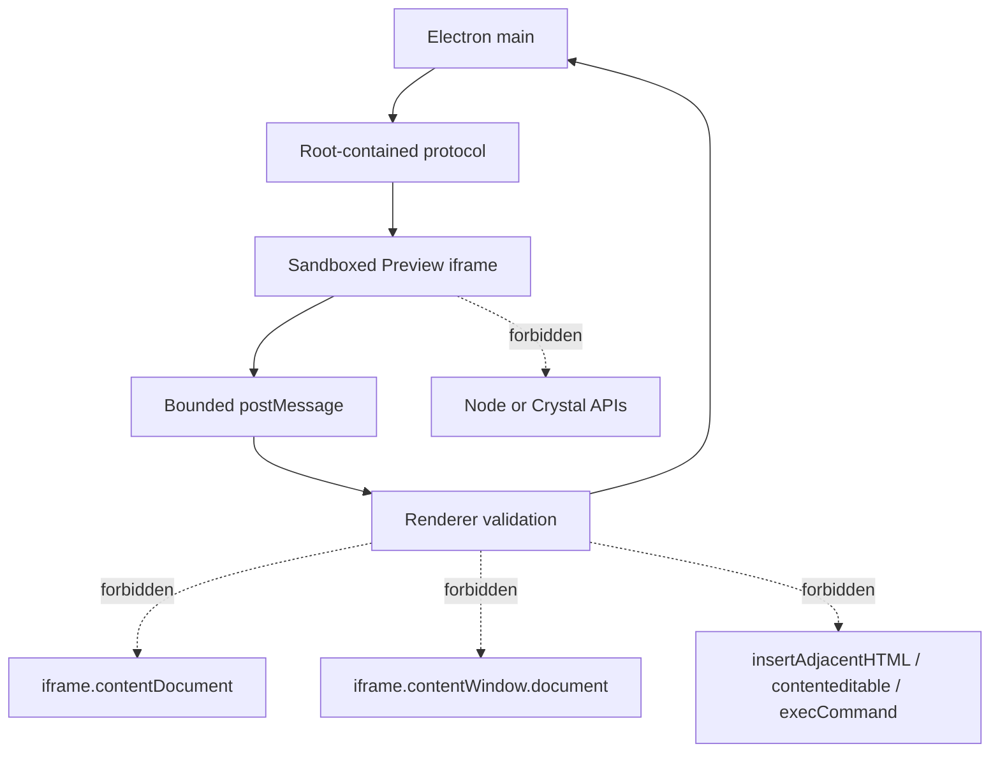

# Preview safety

[Docs index](../../README.md)

## At a glance

| Question | Answer |
| --- | --- |
| Iframe | Sandboxed and isolated from Crystal privileges. |
| Same-origin shortcut | `allow-same-origin` is not used. |
| Renderer DOM access | `iframe.contentDocument` and `iframe.contentWindow.document` remain forbidden. |
| Editor injection | No `insertAdjacentHTML`, `contenteditable`, or `execCommand` shortcuts. |
| Filesystem exposure | Paths and effects stay main-owned. |

## Purpose

Real project HTML can execute scripts, recover malformed markup, request assets, and behave differently from static source. Preview safety lets Crystal display that page without granting it desktop or editor authority.

## Current implementation

Security is layered: hardened BrowserWindow preferences, constrained preload, root-contained protocol serving, sanitized issues, static source reads for DOM Snapshot, inactive-by-default selection injection, bounded message payloads, repeated validation, and external overlays. No single layer is treated as sufficient by itself.

## Key files

The following paths are the shortest reliable entry points. They are not a substitute for following the data flow through the subsystem.

## Key files and responsibilities

| File or path | Responsibility | Reads | Must not do |
| --- | --- | --- | --- |
| `web-preferences.ts` | Locks BrowserWindow security options. | Electron configuration | relax isolation |
| `project-preview-protocol.ts` | Contains file serving to active root. | normalized URLs and root | serve arbitrary local paths |
| `project-preview-issues.ts` | Creates safe diagnostic payloads. | error categories | leak absolute paths |
| `project-dom-snapshot-service.ts` | Reads static source in main. | active target | inspect iframe internals |
| `project-preview-selection-validators.ts` | Bounds selection messages. | unknown payloads | trust page-provided authority |

## Data flow

| Input | Decision | Output |
| --- | --- | --- |
| Resource request | Is the path safe and root-contained? | Response or sanitized issue |
| HTML source | Can main read it safely? | DOM Snapshot input or issue |
| Iframe message | Is it expected, bounded, and current? | Candidate selection or ignored input |
| Missing inspection data | Can a source-derived model provide it? | Model improvement or explicit unsupported state |

## Boundaries

Do not add `allow-same-origin` to make inspection easier. Do not read `iframe.contentDocument` or `iframe.contentWindow.document`. Do not use `insertAdjacentHTML`, `contenteditable`, or `execCommand` as editing shortcuts. Do not expose absolute paths in renderer diagnostics.

> **Safety boundary:** State that crosses a boundary is evidence to validate, not authority to perform a privileged effect.

## What this does not do

| Not provided | Why |
| --- | --- |
| Same-origin iframe inspection | Explicitly rejected by the security model. |
| Editor DOM injection | Would contaminate project behavior and identity. |
| Project source mutation | No write runtime exists. |
| Security bypass for diagnostics | Diagnostics consume sanitized application state only. |

## Common misunderstanding

> **Common misunderstanding:** When Preview lacks information, the safe response is a bounded source-derived model or an explicit limitation—not direct iframe access.

## Validation

Preview, DOM Snapshot, selection, Inspector, source-patch, and architecture validators contain security assertions. Electron preference and protocol changes require direct review as well.

## Related docs

- [Security model](../security-model.md)
- [Project Preview](./project-preview.md)
- [Preview Selection](./preview-selection.md)
- [Security boundaries diagram](../diagrams/security-boundaries.md)

## Future work

Write-capable features must add source validation, command policy, transaction history, refresh orchestration, and explicit persistence without removing any current Preview isolation.
