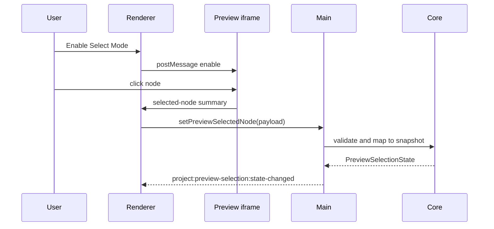

# Preview Selection

[Docs index](../../README.md)

## Purpose

This document explains the read-only Preview Selection bridge and its conservative mapping to DOM Snapshot state.

## Current implementation

Preview Selection uses an injected HTML response script that is inactive by default. Renderer toggles selection mode with namespaced `postMessage` commands. The Preview iframe sends bounded selected-node messages back to renderer. Renderer and main validate payloads. Core maps selected live-preview identity to static DOM Snapshot only when safe.

## Key files

- `packages/core/project/preview-selection/project-preview-selection.types.ts`
- `packages/core/project/preview-selection/project-preview-selection-state.ts`
- `packages/core/project/preview-selection/project-preview-selection-validators.ts`
- `packages/core/project/preview-selection/mapping/project-preview-selection-mapping.ts`
- `packages/core/project/preview-selection/mapping/project-preview-selection-mapping-lookup.ts`
- `apps/desktop/electron/main/preview-selection/project-preview-selection-service.ts`
- `apps/desktop/electron/renderer/components/project-preview-panel/selection/project-preview-selection-message-bridge.ts`
- `scripts/validate-preview-selection.mjs`

## Data flow

Selection mode toggles are sent into the iframe. Selected-node summaries move out through `postMessage`, then into main through IPC. Main stores sanitized selection state and emits state changes. Mapping consumes DOM Snapshot state and returns `matched`, `missing-snapshot`, `stale`, `mismatched`, or `ambiguous`.

## Boundaries

Selection is not editing. It cannot mutate attributes, text, DOM nodes, or files. Renderer does not rely on `event.origin` because the iframe can have an opaque origin; the source window and message type are the important guards. Renderer must not read `iframe.contentDocument` or `iframe.contentWindow.document`.

## Validation

`validate:preview-selection` checks payload validation, message boundaries, mapping states, and forbidden iframe access.

## Related docs

- [DOM Snapshot](./dom-snapshot.md)
- [Visual Selection Overlay](./visual-selection-overlay.md)
- [Preview Inspector](./preview-inspector.md)
- [Preview selection sequence](../diagrams/preview-selection-sequence.md)

## Future work

Future selection may support hover, multi-select, breadcrumbs, or scroll-to-node, but those must remain separate from source mutation until command execution and history boundaries exist.
