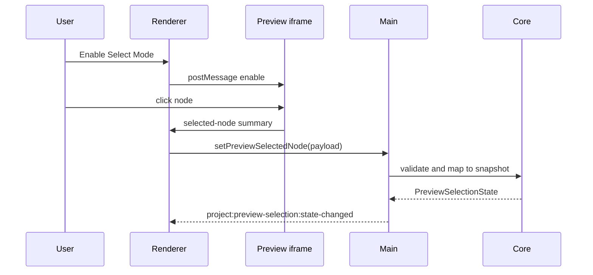

# Preview Selection

[Docs index](../../README.md)

## Purpose

Preview Selection is the bridge between what the user clicks in the rendered page and what Crystal can safely reason about in the source model. It does not edit the page, inspect iframe internals from the renderer, or assume that a visual node is automatically writable. Its job is narrower: capture a bounded selection event, normalize it, and let mapping decide whether the target relates to the DOM Snapshot.

## Current implementation

Selection uses an injected script for HTML responses served through the Preview protocol. The script is inactive by default. Renderer toggles it with namespaced `postMessage` commands. The iframe sends a small selected-node summary back to renderer; renderer validates it and passes it to main, where it is validated again and mapped in core.

The sequence shows why selection is two-step: a visual click comes first, but trusted source identity is only available after mapping against snapshot state.

## Key files

These files separate message transport, state validation, and mapping. Review all three layers before changing selection behavior.

- `packages/core/project/preview-selection/project-preview-selection.types.ts`
- `packages/core/project/preview-selection/project-preview-selection-state.ts`
- `packages/core/project/preview-selection/project-preview-selection-validators.ts`
- `packages/core/project/preview-selection/mapping/project-preview-selection-mapping.ts`
- `packages/core/project/preview-selection/mapping/project-preview-selection-mapping-lookup.ts`
- `apps/desktop/electron/main/preview-selection/project-preview-selection-service.ts`
- `apps/desktop/electron/renderer/components/project-preview-panel/selection/project-preview-selection-message-bridge.ts`
- `scripts/validate-preview-selection.mjs`

## Data flow

The iframe emits tag, structural, attribute, text, and selector preview data within limits. Main stores a sanitized `PreviewSelectionState`. Core mapping compares the selected path and tag to the current DOM Snapshot. The output is either a trusted match or a defensive state such as missing snapshot, stale snapshot, mismatch, or ambiguity.

## Boundaries

Selection is not editing. It cannot mutate attributes, text, DOM nodes, or files. Renderer does not depend on `event.origin` because the sandboxed iframe may have an opaque origin; it checks the source window and message type instead. Renderer must not read `iframe.contentDocument` or `iframe.contentWindow.document`.

## Validation

`validate:preview-selection` checks payload validation, message boundaries, mapping states, and forbidden iframe access.

## Related docs

- [DOM Snapshot](./dom-snapshot.md)
- [Visual Selection Overlay](./visual-selection-overlay.md)
- [Preview Inspector](./preview-inspector.md)
- [Preview selection sequence](../diagrams/preview-selection-sequence.md)

## Future work

Hover selection, multi-selection, breadcrumbs, and scroll-to-node can be added later as separate states. They still should not imply source mutation until command execution and history boundaries exist.
