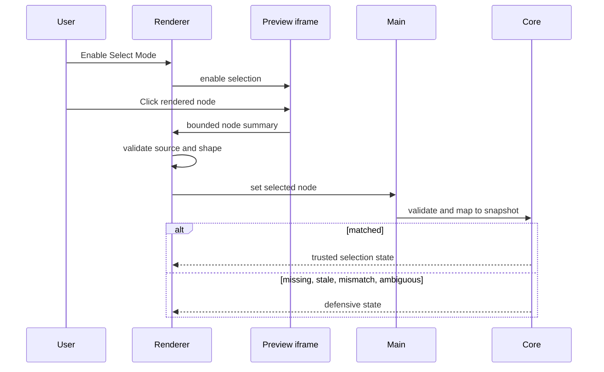

# Preview Selection

[Docs index](../../README.md)

## At a glance

| Question | Answer |
| --- | --- |
| Status | Implemented, read-only. |
| Default mode | Selection script inactive until Select Mode is enabled. |
| Transport | Namespaced `postMessage` payloads. |
| Trust decision | Defensive mapping against DOM Snapshot. |
| Editing authority | None. |

## Purpose

A click in the rendered page is useful only after Crystal turns it into bounded application state and checks whether source-derived structure supports the same identity.

## Current implementation

HTML responses served by the Preview protocol receive a small selection script. Renderer sends enable/disable messages. On click, the script emits a bounded node summary and optional rectangle. Renderer verifies the source window and payload shape, then calls the typed preload method. Main validates again; core maps against current Preview and DOM Snapshot state and returns matched, missing, stale, mismatched, ambiguous, or other defensive state.

## Key files

The following paths are the shortest reliable entry points. They are not a substitute for following the data flow through the subsystem.

## Key files and responsibilities

| File or path | Responsibility | Reads | Must not do |
| --- | --- | --- | --- |
| `project-preview-selection-message-bridge.ts` | Owns iframe message transport and renderer guards. | MessageEvent and active frame | read iframe DOM |
| `project-preview-selection-service.ts` | Owns main selection state. | validated payloads and Preview context | trust arbitrary renderer input |
| `project-preview-selection-validators.ts` | Checks bounded payload shape. | unknown candidate data | infer missing fields |
| `project-preview-selection-mapping.ts` | Calculates mapping status. | selection and DOM Snapshot | accept ambiguity as match |
| `project-preview-selection-mapping-lookup.ts` | Finds candidate snapshot nodes. | paths, tags, and bounded attributes | mutate snapshot |

## Data flow

| Input | Decision | Output |
| --- | --- | --- |
| Select Mode toggle | Should iframe interception be active? | Enable or disable message |
| Iframe click | Is selection active and payload bounded? | Selected-node summary |
| Renderer message | Does source window and shape match expectations? | Main request or ignored input |
| Main/core mapping | Does current snapshot confirm identity? | Matched or defensive selection |
| Selection result | May consumers trust details and geometry? | Inspector/overlay state or explanation |

## Boundaries

Selection cannot mutate attributes, text, DOM nodes, styles, or files. Renderer must not use `iframe.contentDocument` or `iframe.contentWindow.document`. A payload is evidence, never edit permission.

> **Safety boundary:** State that crosses a boundary is evidence to validate, not authority to perform a privileged effect.

## What this does not do

| Not provided | Why |
| --- | --- |
| Text or attribute editing | No execution runtime exists. |
| Live iframe query | Isolation is preserved. |
| Trust on ambiguity | Ambiguous and stale states remain defensive. |
| Persistent identity | Selection depends on current Preview load and Snapshot state. |

## Common misunderstanding

> **Common misunderstanding:** Select Mode makes the page selectable, not editable. A visual target becomes trustworthy only within the current validated mapping context.

## Validation

`npm run validate:preview-selection` checks message boundaries, payload limits, load identity, mapping states, rectangle validation, and forbidden iframe access.

## Related docs

- [DOM Snapshot](./dom-snapshot.md)
- [Preview Inspector](./preview-inspector.md)
- [Visual Selection Overlay](./visual-selection-overlay.md)
- [Selection flow](../flows/preview-selection-flow.md)

## Future work

Hover, breadcrumbs, scroll-to-node, and multi-selection should become explicit read-only states first. Their eventual use in editing still requires source freshness and command policy.
