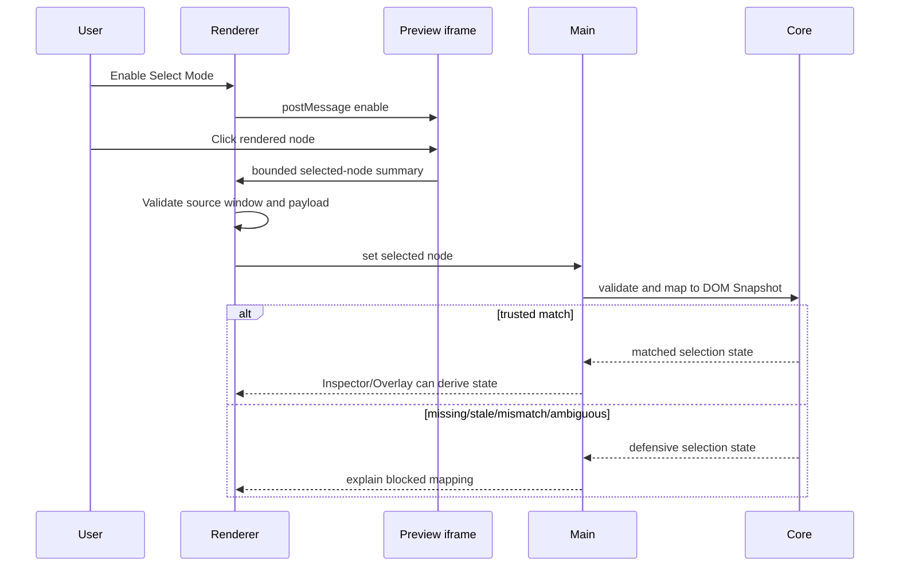

# Preview Selection

[Docs index](../../README.md)

## At a glance

| Question | Answer |
| --- | --- |
| Is this implemented? | Yes, as read-only bounded selection plus mapping. |
| Can it write source files? | No. |
| Runtime owner | Iframe emits bounded data; renderer validates transport; main/core validate and map. |
| Safety risk controlled | Prevents visual clicks from becoming implicit source mutation. |
| Related next phase | Future selection states before any write runtime. |

## Purpose

Preview Selection bridges what the user clicks in the rendered page and what Crystal can safely reason about in the source model. It captures a bounded selection event, normalizes it, and lets mapping decide whether the target relates to the DOM Snapshot.

## Why this exists

A visual click is useful only after it becomes a safe application state. Selection exists to keep that conversion explicit and defensive.

## How to read this page

| Need | Focus |
| --- | --- |
| Message transport | Main diagram and key files. |
| Mapping confidence | Data flow and blocked states. |
| Security constraints | Boundaries and Preview safety. |

## Current implementation

Selection uses an injected script for HTML responses served through the Preview protocol. The script is inactive by default. Renderer toggles it with namespaced `postMessage` commands. The iframe sends a small selected-node summary back to renderer; renderer validates it and passes it to main, where it is validated again and mapped in core.

| Implemented | Blocked | Future |
| --- | --- | --- |
| Select Mode off by default. | Text/attribute editing. | Hover selection. |
| Bounded selected-node payloads. | DOM mutation. | Multi-selection. |
| Snapshot mapping states. | Live iframe DOM reads. | Breadcrumb and scroll-to-node behavior. |

## Key files

These files separate message transport, state validation, and mapping. Review all three layers before changing selection behavior.

## Key files and responsibilities

| File | Responsibility | Reads | Must not do |
| --- | --- | --- | --- |
| `project-preview-selection-message-bridge.ts` | Handles renderer/iframe messages. | Message source and payload. | Read iframe DOM. |
| `project-preview-selection-service.ts` | Stores main selection state. | Validated payloads. | Trust renderer blindly. |
| `project-preview-selection-validators.ts` | Guards payload shape. | Candidate payload. | Infer missing source. |
| `project-preview-selection-mapping.ts` | Maps selection to snapshot. | Selection + DOM Snapshot. | Treat ambiguity as match. |
| `project-preview-selection-mapping-lookup.ts` | Finds candidate snapshot nodes. | Snapshot paths and tag data. | Mutate snapshot. |

## Data flow

| Input | Decision | Output |
| --- | --- | --- |
| Select Mode toggle | Should iframe selection script activate? | Enable/disable message. |
| Iframe click | Is payload bounded and shaped correctly? | Selected-node summary. |
| Selected-node summary | Does snapshot confirm the target? | Matched or defensive mapping. |
| Mapping state | Can downstream panels trust it? | Inspector/Overlay state or fallback. |

## Main diagram

## Boundaries

Selection is not editing. It cannot mutate attributes, text, DOM nodes, or files. Renderer must not read `iframe.contentDocument` or `iframe.contentWindow.document`.

> **Safety boundary:** A selected-node payload is evidence to validate, not authority to edit.

## What this does not do

| Not provided | Reason |
| --- | --- |
| Source writes | No write runtime. |
| Attribute/text editing | Inspector is read-only. |
| Live DOM query | Preview isolation. |
| Trusted mapping on ambiguity | Avoids corrupting future source operations. |

## Common misunderstanding

> **Common misunderstanding:** Selection mode makes the page selectable, not editable.

## Validation

`validate:preview-selection` checks payload validation, message boundaries, mapping states, and forbidden iframe access.

## Related docs

- [DOM Snapshot](./dom-snapshot.md)
- [Visual Selection Overlay](./visual-selection-overlay.md)
- [Preview Inspector](./preview-inspector.md)
- [Preview selection sequence](../diagrams/preview-selection-sequence.md)

## Future work

Hover selection, multi-selection, breadcrumbs, and scroll-to-node can be added later as separate states. They still should not imply source mutation until command execution and history boundaries exist.
