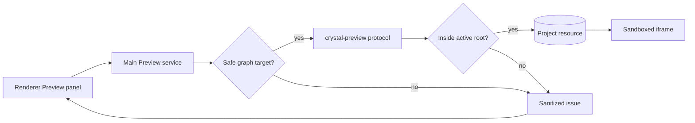

# Project Preview

[Docs index](../../README.md)

## At a glance

| Question | Answer |
| --- | --- |
| Status | Implemented, read-only. |
| Protocol | `crystal-preview://current/<project-relative-path>`. |
| Authority | Electron main resolves targets and serves bytes. |
| Diagnostics | Sanitized bounded issues. |
| Writes | None. |

## Purpose

Project Preview answers a narrow privileged question: which resource inside the active project may Chromium load, and how should failures be reported without exposing local filesystem details?

## Current implementation

A page selected from Project Graph becomes Preview target state. Main normalizes the project-relative path, confirms containment within the active root, resolves supported content, and serves it through the custom protocol. Renderer displays loading, ready, blocked, issue, and reload state without constructing absolute paths.

## Key files

The following paths are the shortest reliable entry points. They are not a substitute for following the data flow through the subsystem.

## Key files and responsibilities

| File or path | Responsibility | Reads | Must not do |
| --- | --- | --- | --- |
| `packages/core/project/preview/project-preview.types.ts` | Preview target and state contracts. | plain model data | perform IO |
| `packages/core/project/preview/project-preview-target.ts` | Validates project-relative target identity. | graph paths | trust arbitrary strings |
| `apps/desktop/electron/main/preview/project-preview-service.ts` | Owns active Preview lifecycle. | active graph and root | delegate safety to renderer |
| `apps/desktop/electron/main/preview/project-preview-protocol.ts` | Serves allowed resources. | normalized root-contained paths | serve traversal or outside-root requests |
| `apps/desktop/electron/renderer/components/project-preview-panel` | Presents controls and status. | sanitized state | read files |

## Data flow

| Input | Decision | Output |
| --- | --- | --- |
| Load request | Is a page selected in Project Graph? | Target or missing-target state |
| Protocol URL | Is the path normalized and root-contained? | File response or blocked issue |
| File response | Is the MIME type supported? | Rendered resource or diagnostic |
| Watcher refresh | Does the active page or direct dependency require reload? | Reload request or no change |

## Boundaries

Renderer does not build filesystem paths or decide containment. Protocol failures expose safe categories and project-relative context, not raw absolute paths. Serving a file does not make it editable.

> **Safety boundary:** State that crosses a boundary is evidence to validate, not authority to perform a privileged effect.

## What this does not do

| Not provided | Why |
| --- | --- |
| Arbitrary local server | The protocol serves active-project resources only. |
| Browser automation | No Playwright or Spectron runtime is part of Preview. |
| Source persistence | Preview reads and reports; it does not write. |
| Automatic trust of dependencies | A loaded asset may still be external, missing, or unsupported. |

## Common misunderstanding

> **Common misunderstanding:** A successful load proves that Chromium received a resource. It does not prove every dependency is local, source-mapped, or writable.

## Validation

`npm run validate:preview` checks target resolution, containment, diagnostics, MIME handling, issue coalescing, and forbidden path behavior.

## Related docs

- [Preview architecture](./README.md)
- [Preview safety](./preview-safety.md)
- [Project open flow](../flows/project-open-flow.md)
- [Security model](../security-model.md)

## Future work

Post-write reload must be driven by a validated refresh boundary, not by indiscriminate iframe reloads or raw watcher events.
