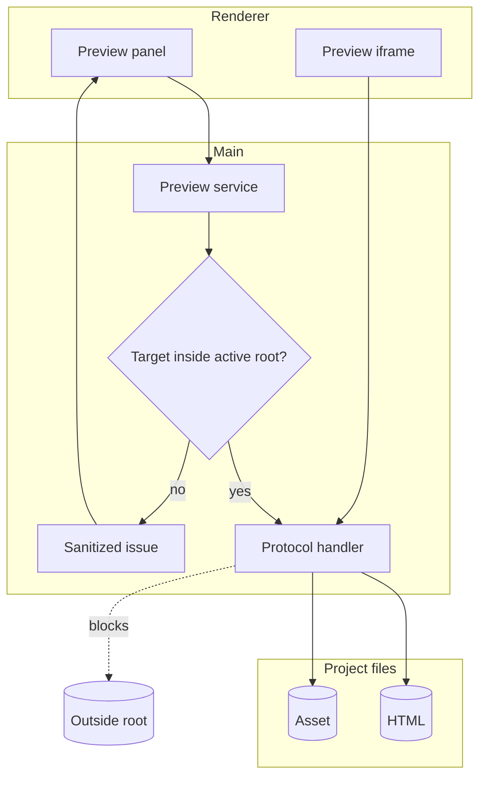

# Project Preview

[Docs index](../../README.md)

## At a glance

| Question | Answer |
| --- | --- |
| Is this implemented? | Yes, for read-only project-relative rendering. |
| Can it write source files? | No. |
| Runtime owner | Electron main owns target resolution and protocol serving. |
| Safety risk controlled | Prevents Preview URLs from becoming arbitrary local file reads. |
| Related next phase | Refresh planning after future writes. |

## Purpose

Project Preview bridges the scanned project model and Chromium rendering. It answers one narrow question: given an active project and a selected HTML page, what can Crystal safely serve to an isolated iframe?

## Why this exists

The renderer should not construct filesystem paths or decide what can be served. Main owns that decision because Preview requests touch local files.

## How to read this page

| Topic | Section |
| --- | --- |
| Load lifecycle | Current implementation and data flow. |
| File serving risk | Boundaries and main diagram. |
| Diagnostics | Key files and validation. |

## Current implementation

Electron main owns Preview load state and the `crystal-preview://current/<relative-project-path>` protocol. Core defines target, state, issue, path, and reload models. Renderer displays controls and status but asks preload/main to resolve targets and state.

| Implemented | Blocked | Future |
| --- | --- | --- |
| Target selection from Project Graph. | Renderer path construction. | Reload after future source writes. |
| Safe custom protocol. | Traversal/out-of-root serving. | Richer diagnostics. |
| Bounded Preview issues. | Absolute path exposure. | Refresh invalidation contracts. |

## Key files

Start with the core model files, then read the main service/protocol files, and finally the renderer panel.

## Key files and responsibilities

| File | Responsibility | Reads | Must not do |
| --- | --- | --- | --- |
| `packages/core/project/preview/project-preview.types.ts` | Preview state contracts. | Shared model data. | Perform IO. |
| `packages/core/project/preview/project-preview-target.ts` | Target validation helpers. | Project-relative paths. | Trust arbitrary paths. |
| `packages/core/project/preview/project-preview-issues.ts` | Issue model and coalescing. | Safe issue fields. | Expose absolute paths. |
| `apps/desktop/electron/main/preview/project-preview-service.ts` | Main Preview state service. | Active graph/root. | Delegate path safety to renderer. |
| `apps/desktop/electron/main/preview/project-preview-protocol.ts` | Protocol handler. | Active root and resource path. | Serve outside-root files. |
| `apps/desktop/electron/renderer/components/project-preview-panel/project-preview-panel.ts` | Preview UI. | Sanitized Preview state. | Read filesystem. |

## Data flow

| Input | Decision | Output |
| --- | --- | --- |
| Renderer load request | Is a Project Graph page selected? | Preview target or missing-target state. |
| Resource request | Is the path normalized and inside root? | Served bytes or blocked issue. |
| Read/fallback result | Is MIME supported? | Response or warning. |
| Watcher refresh | Does it affect current page/dependencies? | Reload request or no-op. |

## Main diagram

## Boundaries

Renderer does not construct absolute paths, read project files, or decide whether a resource is safe. The protocol rejects traversal and outside-root requests.

> **Safety boundary:** Preview serving is main-owned because it reads from the user's filesystem.

## What this does not do

| Not provided | Reason |
| --- | --- |
| Source writes | Preview only serves and reports. |
| Browser automation | No Playwright/Spectron layer exists. |
| Full dev server behavior | The protocol serves active-project files only. |

## Common misunderstanding

> **Common misunderstanding:** A successful Preview load does not mean all source dependencies are editable or even local.

## Validation

`validate:preview` checks target resolution, protocol constraints, diagnostics, issue coalescing, and forbidden behavior.

## Related docs

- [Preview safety](./preview-safety.md)
- [DOM Snapshot](./dom-snapshot.md)
- [Project open flow](../flows/project-open-flow.md)
- [Security model](../security-model.md)

## Future work

A future write runtime will need to tell Preview when to reload and when to invalidate derived state. Phase 6C should model that refresh boundary without applying source changes.
