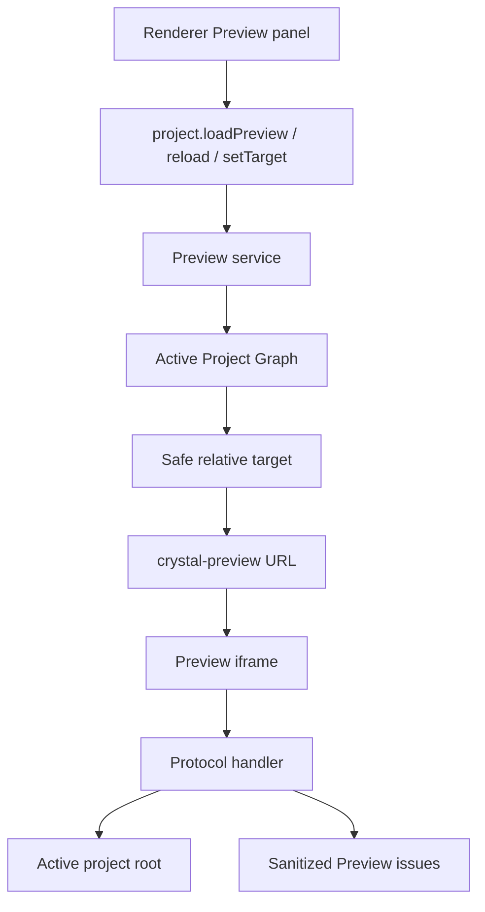

# Project Preview

[Docs index](../../README.md)

## Purpose

This document explains the current real Preview pipeline: target selection, safe URL generation, protocol serving, reload planning, and diagnostics.

## Current implementation

Electron main owns Preview load state and the `crystal-preview://current/<relative-project-path>` protocol. Core owns target, issue, state, path, and reload models. Renderer displays the Preview panel and sends explicit load/reload/target requests through preload.

## Key files

- `packages/core/project/preview/project-preview.types.ts`
- `packages/core/project/preview/project-preview-state.ts`
- `packages/core/project/preview/project-preview-target.ts`
- `packages/core/project/preview/project-preview-path.ts`
- `packages/core/project/preview/project-preview-issues.ts`
- `packages/core/project/preview/project-preview-reload.ts`
- `apps/desktop/electron/main/preview/project-preview-service.ts`
- `apps/desktop/electron/main/preview/project-preview-protocol.ts`
- `apps/desktop/electron/renderer/components/project-preview-panel/project-preview-panel.ts`

## Data flow

Renderer requests a target or reload. Main validates that the target exists in the active graph and stays inside the active root. Main returns a safe custom protocol URL. The iframe requests project resources through the protocol handler. The handler resolves each request under the active root, serves supported content, and records sanitized issues.

## Boundaries

Renderer does not construct absolute paths. Preview resource requests outside the active root are blocked. Traversal is blocked. Unsupported MIME fallback is informational and bounded. The Preview panel does not execute source writes or inspect the live iframe document.

## Validation

`validate:preview` checks target resolution, protocol constraints, diagnostics, and forbidden behavior.

## Related docs

- [Preview safety](./preview-safety.md)
- [DOM Snapshot](./dom-snapshot.md)
- [Preview pipeline diagram](../diagrams/system-context.md)
- [Project open flow](../flows/project-open-flow.md)

## Future work

Phase 6C should add refresh-boundary planning contracts for future source writes. Current reload planning remains conservative and downstream from Project Graph refresh.
