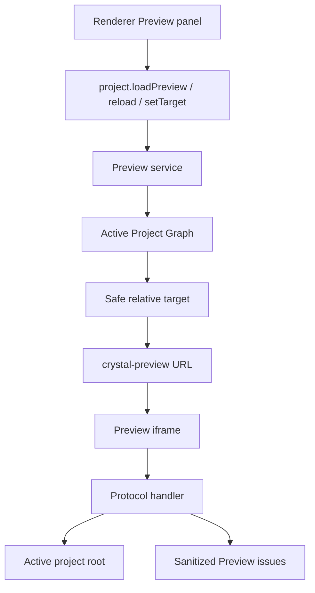

# Project Preview

[Docs index](../../README.md)

## Purpose

Project Preview is the bridge between the scanned project model and Chromium's rendering engine. It answers one narrow question: given an active project and a selected HTML page, what can Crystal safely serve to an isolated iframe?

## Current implementation

Electron main owns Preview load state and the `crystal-preview://current/<relative-project-path>` protocol. Core defines target, state, issue, path, and reload models. Renderer displays controls and status but asks preload/main to resolve targets and state.

The diagram follows a page load from renderer intent to protocol serving. Diagnostics are produced by main, not by renderer guessing filesystem state.

## Key files

Start with the core model files to understand the state shape, then read the main service/protocol files for the privileged path, and finally the renderer panel for presentation.

- `packages/core/project/preview/project-preview.types.ts`
- `packages/core/project/preview/project-preview-state.ts`
- `packages/core/project/preview/project-preview-target.ts`
- `packages/core/project/preview/project-preview-path.ts`
- `packages/core/project/preview/project-preview-issues.ts`
- `packages/core/project/preview/project-preview-reload.ts`
- `apps/desktop/electron/main/preview/project-preview-service.ts`
- `apps/desktop/electron/main/preview/project-preview-protocol.ts`
- `apps/desktop/electron/renderer/components/project-preview-panel/project-preview-panel.ts`

## Data flow

The renderer requests load, reload, or target change. Main checks the target against the active Project Graph and root. The protocol handler resolves iframe resource requests under that root, serves supported content, and records bounded issues for missing, blocked, unreadable, or fallback-served resources.

## Boundaries

Renderer does not construct absolute paths, read project files, or decide whether a resource is safe. The protocol rejects traversal and outside-root requests. Preview is rendering and diagnostics only; it is not a browser console, source editor, or write service.

## Validation

`validate:preview` checks target resolution, protocol constraints, diagnostics, issue coalescing, and forbidden behavior.

## Related docs

- [Preview safety](./preview-safety.md)
- [DOM Snapshot](./dom-snapshot.md)
- [Project open flow](../flows/project-open-flow.md)
- [Security model](../security-model.md)

## Future work

A future write runtime will need to tell Preview when to reload and when to invalidate derived state. Phase 6C should model that refresh boundary without applying source changes.
