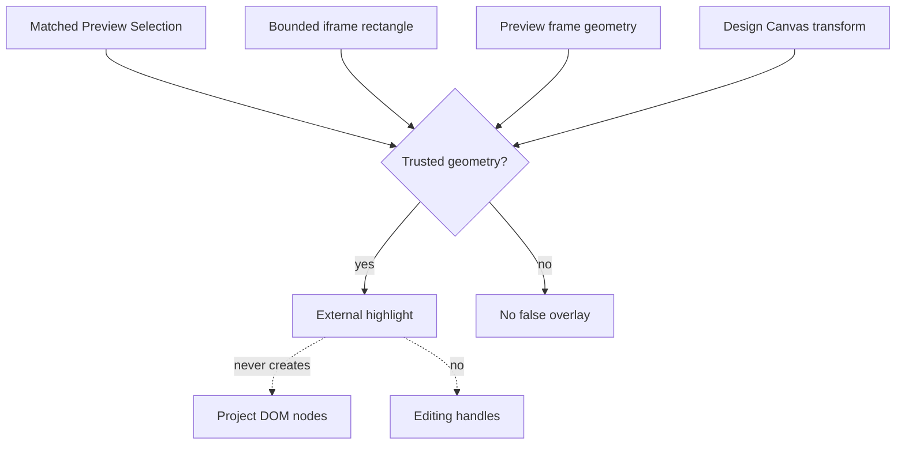

# Visual Selection Overlay

[Docs index](../../README.md)

## At a glance

| Question | Answer |
| --- | --- |
| Status | Implemented, read-only. |
| Location | Outside the iframe, inside the transformed Design Canvas stage. |
| Input | Matched selection, validated rectangle, frame geometry, and canvas transform. |
| Interaction | `pointer-events: none`. |
| Editing handles | Not implemented. |

## Purpose

Crystal needs visual feedback for a matched selection, but inserting highlight nodes or handles into project HTML would change the document being inspected. The overlay therefore belongs to Crystal UI.

## Current implementation

The injected selection script reports a bounded rectangle in iframe-viewport coordinates. After transport validation and trusted Snapshot mapping, renderer projects that rectangle into Design Canvas coordinates. The overlay follows pan, zoom, Fit, Center, Reset, and resize. Defensive mapping or invalid geometry yields no false highlight.

## Key files

The following paths are the shortest reliable entry points. They are not a substitute for following the data flow through the subsystem.

## Key files and responsibilities

| File or path | Responsibility | Reads | Must not do |
| --- | --- | --- | --- |
| `packages/core/project/design-canvas/selection-overlay` | Defines projection states and contracts. | selection and viewport inputs | define mutation effects |
| `components/design-canvas` | Owns stage transforms and frame geometry. | canvas viewport state | inspect live iframe DOM |
| `components/project-preview-panel` | Coordinates selection lifecycle. | Preview and selection state | apply source changes |
| `project-preview-selection-message-bridge.ts` | Receives bounded selection rectangles. | MessageEvent data | trust invalid coordinates |
| `scripts/validate-visual-selection-overlay.mjs` | Guards projection and no-mutation assumptions. | source files and fixtures | patch runtime |

## Data flow

| Input | Decision | Output |
| --- | --- | --- |
| Matched selection | Is mapping current and trusted? | Projection candidate or no overlay |
| Selection rectangle | Is it finite, bounded, non-zero, and in expected coordinates? | Safe geometry or defensive state |
| Canvas transform | How does frame map to stage? | Projected external rectangle |
| Preview lifecycle | Did target/load/selection change? | Clear or recompute overlay |

## Boundaries

The overlay cannot select by itself, block iframe interaction, mutate project DOM, compute styles, expose editable handles, or trigger source commands. Geometry is visual evidence tied to the current load and mapping state.

> **Safety boundary:** State that crosses a boundary is evidence to validate, not authority to perform a privileged effect.

## What this does not do

| Not provided | Why |
| --- | --- |
| DOM injection | Crystal UI remains separate from project HTML. |
| Move or resize handles | No write command or history exists. |
| Persistent browser layout model | Geometry is current bounded message data. |
| WebGPU rendering | The MVP uses renderer HTML/CSS. |

## Common misunderstanding

> **Common misunderstanding:** The highlight is not a child of the selected element. It is Crystal-owned UI projected over the iframe.

## Validation

`npm run validate:visual-selection-overlay` checks rectangle bounds, lifecycle clearing, projection states, pointer transparency, and absence of project-DOM mutation.

## Related docs

- [Preview Selection](./preview-selection.md)
- [Design view](../renderer-shell/design-view.md)
- [Overlay MVP note](../../visual-selection-overlay.md)
- [Preview Selection sequence](../diagrams/preview-selection-sequence.md)

## Future work

Hover outlines, measurements, guides, rulers, reflow hardening, and edit handles should remain separate capabilities. Handles require executable commands and history; WebGPU requires a proven rendering contract and fallback.
