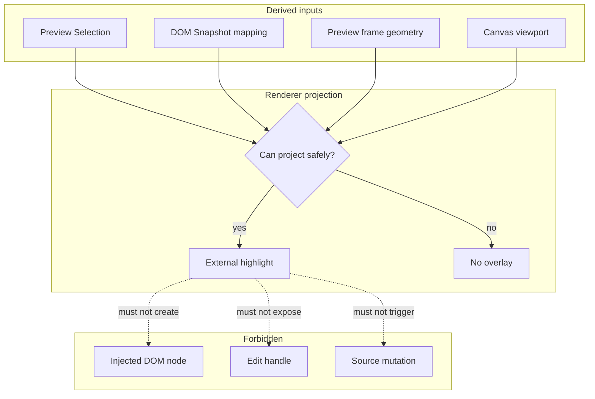

# Visual Selection Overlay

[Docs index](../../README.md)

## At a glance

| Question | Answer |
| --- | --- |
| Is this implemented? | Yes, as read-only external projection. |
| Can it write source files? | No. |
| Runtime owner | Renderer projects core-derived selection state over the Preview frame. |
| Safety risk controlled | Keeps Crystal overlay UI outside the user's document. |
| Related next phase | Overlay hardening and refresh invalidation. |

## Purpose

The Visual Selection Overlay makes a read-only selection visible without inserting Crystal UI into the user's document. Overlay graphics belong to Crystal's workspace, not to the project being previewed.

## Why this exists

Visual feedback is needed for selection, but injecting handles or highlight nodes into user HTML would contaminate the page and blur the editor/document boundary.

## How to read this page

| Need | Focus |
| --- | --- |
| Projection inputs | Data flow table. |
| Safety boundary | What this does not do. |
| Future overlay work | Future work and related docs. |

## Current implementation

The overlay sits outside the Preview iframe and projects highlight geometry for a matched selection. It is driven by Preview Selection, DOM Snapshot mapping, Preview frame geometry, and Design Canvas viewport state.

| Implemented | Blocked | Future |
| --- | --- | --- |
| External selection highlight. | Editing handles. | Hover outlines. |
| Defensive missing-state behavior. | DOM injection. | Measurements and guides. |
| Canvas-aware projection. | Layout/style editing. | Scroll/reflow hardening. |

## Key files

The current overlay types live in core; renderer integration is inside the Design Canvas and Preview panel surfaces.

## Key files and responsibilities

| File or path | Responsibility | Reads | Must not do |
| --- | --- | --- | --- |
| `packages/core/project/design-canvas/selection-overlay/project-design-canvas-selection-overlay.types.ts` | Overlay model contract. | Selection/canvas state shapes. | Define edit handles. |
| `apps/desktop/electron/renderer/components/design-canvas/**` | Canvas transform and projection surface. | Canvas viewport + frame geometry. | Mutate user DOM. |
| `apps/desktop/electron/renderer/components/project-preview-panel/**` | Selection UI integration. | Preview and selection state. | Apply source changes. |
| `scripts/validate-visual-selection-overlay.mjs` | Overlay boundary validation. | Source files. | Patch runtime code. |

## Data flow

| Input | Decision | Output |
| --- | --- | --- |
| Matched selection | Is mapping trusted? | Overlay can project. |
| Preview geometry | Is frame measurable? | Highlight coordinates. |
| Canvas transform | How should coordinates be scaled? | External overlay box. |
| Missing data | Can projection be trusted? | Defensive empty state. |

## Main diagram

## Boundaries

The overlay is read-only. It does not select by itself, edit source, compute styles, inspect live layout internals, create resize handles, or inject nodes into the user's DOM.

> **Safety boundary:** External projection keeps Crystal UI separate from project HTML.

## What this does not do

| Not provided | Reason |
| --- | --- |
| Editing handles | Requires command execution and undo. |
| DOM injection | Would pollute user document. |
| Persistent bounding boxes | Future overlay system. |

## Common misunderstanding

> **Common misunderstanding:** The overlay is not a layer inside the iframe. It is Crystal UI projected over the iframe.

## Validation

`validate:visual-selection-overlay` checks lifecycle, defensive states, and no user-DOM mutation assumptions.

## Related docs

- [Preview Selection](./preview-selection.md)
- [Design view](../renderer-shell/design-view.md)
- [Preview Inspector](./preview-inspector.md)
- [Preview selection sequence](../diagrams/preview-selection-sequence.md)

## Future work

Overlay hardening should address iframe scroll, resize, reflow, hover, layout badges, measurements, rulers, and guides. Editing handles remain future work until command execution and undo/redo are real.
