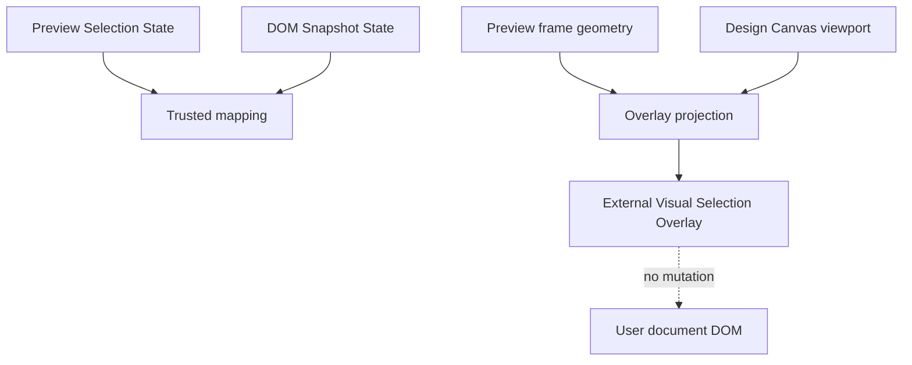

# Visual Selection Overlay

[Docs index](../../README.md)

## Purpose

The Visual Selection Overlay makes a read-only selection visible without inserting Crystal UI into the user's document. That distinction matters: overlay graphics belong to Crystal's workspace, not to the project being previewed.

## Current implementation

The overlay sits outside the Preview iframe and projects highlight geometry for a matched selection. It is driven by Preview Selection, DOM Snapshot mapping, Preview frame geometry, and Design Canvas viewport state. It does not provide editing handles or persistent project DOM nodes.

The diagram should be read as a projection pipeline. The overlay is a view over existing state; it is not an input source for writes.

## Key files

The current overlay types live in core; renderer integration is inside the Design Canvas and Preview panel surfaces.

- `packages/core/project/design-canvas/selection-overlay/project-design-canvas-selection-overlay.types.ts`
- `apps/desktop/electron/renderer/components/design-canvas/**`
- `apps/desktop/electron/renderer/components/project-preview-panel/**`
- `scripts/validate-visual-selection-overlay.mjs`

## Data flow

When selection and mapping state are usable, renderer computes how the selected target should appear over the transformed Preview frame. If snapshot, mapping, or geometry data is missing, the overlay renders a defensive state or stays unavailable.

## Boundaries

The overlay is read-only. It does not select by itself, edit source, compute styles, inspect live layout internals, create resize handles, or inject nodes into the user's DOM. Keeping the overlay external avoids contaminating the project and avoids a future cleanup problem when the Preview reloads.

## Validation

`validate:visual-selection-overlay` checks lifecycle, defensive states, and no user-DOM mutation assumptions.

## Related docs

- [Preview Selection](./preview-selection.md)
- [Design view](../renderer-shell/design-view.md)
- [Preview Inspector](./preview-inspector.md)
- [Preview selection sequence](../diagrams/preview-selection-sequence.md)

## Future work

Overlay hardening should address iframe scroll, resize, reflow, hover, layout badges, measurements, rulers, and guides. Editing handles remain future work until command execution and undo/redo are real.
