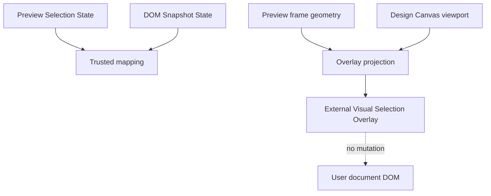

# Visual Selection Overlay

[Docs index](../../README.md)

## Purpose

This document describes the current Visual Selection Overlay MVP and its relationship to Preview Selection and Design Canvas.

## Current implementation

The overlay is external to the Preview iframe. It projects a read-only highlight for matched Preview selections using existing selection and snapshot-derived data. It does not inject persistent overlay nodes into the user's document and does not implement editing handles.

## Key files

- `packages/core/project/design-canvas/selection-overlay/project-design-canvas-selection-overlay.types.ts`
- `apps/desktop/electron/renderer/components/design-canvas/**`
- `apps/desktop/electron/renderer/components/project-preview-panel/**`
- `scripts/validate-visual-selection-overlay.mjs`

## Data flow

Overlay state is derived from Preview Selection, mapping status, DOM Snapshot availability, Preview frame geometry, and Design Canvas viewport transforms. It renders outside the iframe, so it can remain controlled by Crystal UI without contaminating the user's project DOM.

## Boundaries

The overlay is read-only. It does not select by itself, edit by itself, write source, compute styles, inspect live layout internals, create draggable resize handles, or inject nodes into the user document. Defensive states are expected when snapshot or geometry data is missing.

## Validation

`validate:visual-selection-overlay` checks overlay lifecycle, defensive states, and no user-DOM mutation assumptions.

## Related docs

- [Preview Selection](./preview-selection.md)
- [Design view](../renderer-shell/design-view.md)
- [Preview Inspector](./preview-inspector.md)
- [Preview selection sequence](../diagrams/preview-selection-sequence.md)

## Future work

Future overlay hardening should handle iframe scroll, resize, reflow, hover highlights, layout badges, measurements, rulers, and guides. Editing handles remain Future until command execution and undo/redo are implemented.
