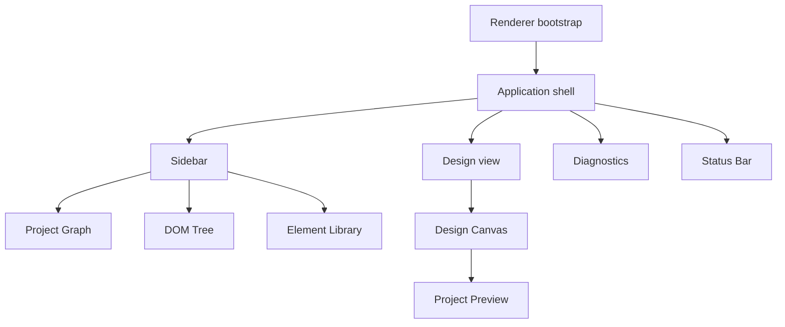

# Renderer shell architecture

[Docs index](../../README.md)

## Purpose

The renderer shell turns application state into a coherent workspace. Its job is composition: arrange project navigation, Preview, inspection, diagnostics, and dry-run controls without inheriting privileged authority.

## Current implementation

The shell composes the sidebar, Design view, Design Canvas, Project Preview, DOM Tree, Preview Inspector, external selection overlay, Element Library, Diagnostics, and Status Bar. Components call the constrained preload API for main-owned operations and subscribe to sanitized updates. Shell behavior is read-only with respect to project source.

## Key files

- `apps/desktop/electron/renderer/app/bootstrap/bootstrap.ts`
- `apps/desktop/electron/renderer/layout/app-shell/app-shell.html`
- `apps/desktop/electron/renderer/layout/side-bar/side-bar.html`
- `apps/desktop/electron/renderer/views/design/design.html`
- `apps/desktop/electron/renderer/layout/status-bar/status-bar.html`

## Data flow

Bootstrap initializes controllers and views. Feature components subscribe to state, derive presentation, attach browser events, and request privileged work through `window.crystal`. Preview controls and Inspector/diagnostic panels stay outside Design Canvas transforms; the project page remains inside the sandboxed iframe.

## Boundaries

The shell does not write files, expose raw IPC, relax sandboxing, inspect the live iframe document, or hide feature execution inside presentation primitives. A disabled future control remains disabled rather than becoming a local-only shortcut.

## Validation

`validate:ui-flow` covers shell composition and DevTools behavior. Design Canvas, overlay, Element Library, editable-Inspector, and CSS/Sass surface validators guard their respective components.

## Related docs

- [Shell UI primitives](./shell-ui-primitives.md)
- [Design view](./design-view.md)
- [Sidebar composition](./sidebar-composition.md)
- [Diagnostics](./diagnostics.md)
- [Status Bar](./status-bar.md)

## Future work

Add shell primitives only after repeated use demonstrates a shared visual grammar. Keep feature logic in feature modules and preserve clear boundaries around transformed Preview content.
