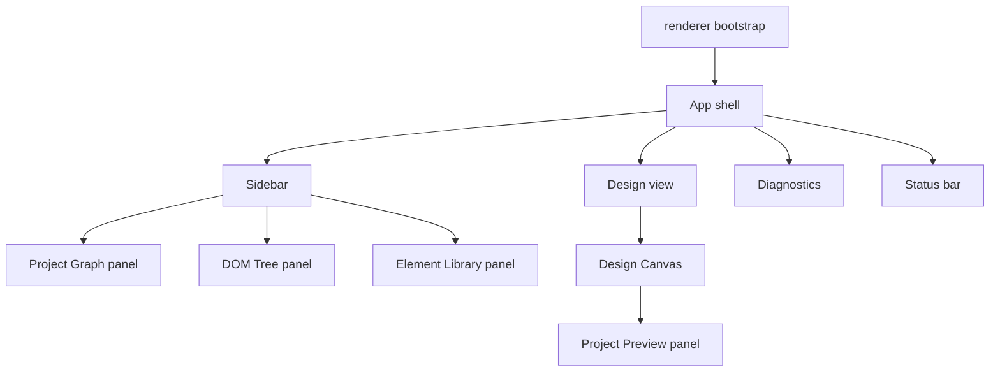

# Renderer Shell Architecture

[Docs index](../../README.md)

## Purpose

This document describes the renderer shell as the composition layer for Crystal's current read-only product surface.

## Current implementation

The renderer shell composes layout, Project Graph, Design view, Preview panel, DOM Tree, Preview Inspector, Visual Selection Overlay, Element Library, Diagnostics, and Status Bar. It is not a privileged runtime and does not own project persistence.

## Key files

- `apps/desktop/electron/renderer/app/bootstrap/bootstrap.ts`
- `apps/desktop/electron/renderer/layout/app-shell/app-shell.html`
- `apps/desktop/electron/renderer/layout/side-bar/side-bar.html`
- `apps/desktop/electron/renderer/layout/status-bar/status-bar.html`
- `apps/desktop/electron/renderer/views/design/design.html`
- `apps/desktop/electron/renderer/components/project-graph-panel/project-graph-panel.ts`
- `apps/desktop/electron/renderer/components/project-preview-panel/project-preview-panel.ts`
- `apps/desktop/electron/renderer/components/html-element-library-panel/html-element-library-panel.ts`

## Data flow

Bootstrap wires component initialization. Components call preload APIs, subscribe to state changes, and re-render. The shell groups controls by intent and keeps Preview controls, diagnostics, selection summary, and Inspector outside Design Canvas transforms.

## Boundaries

Renderer shell is visual composition only. It does not write files, bypass preload, relax iframe sandboxing, or inspect live iframe documents. Shell primitives must remain reusable UI building blocks, not feature-specific hidden behavior.

## Validation

`validate:ui-flow`, `validate:design-canvas`, `validate:visual-selection-overlay`, `validate:html-element-library`, and `validate:source-patch-preview` guard current shell behavior.

## Related docs

- [Shell UI primitives](./shell-ui-primitives.md)
- [Design view](./design-view.md)
- [Diagnostics](./diagnostics.md)
- [Sidebar composition](./sidebar-composition.md)
- [Status bar](./status-bar.md)

## Future work

Future shell work should keep components modular, preserve compact density, and avoid mixing UI chrome work with runtime feature changes.
