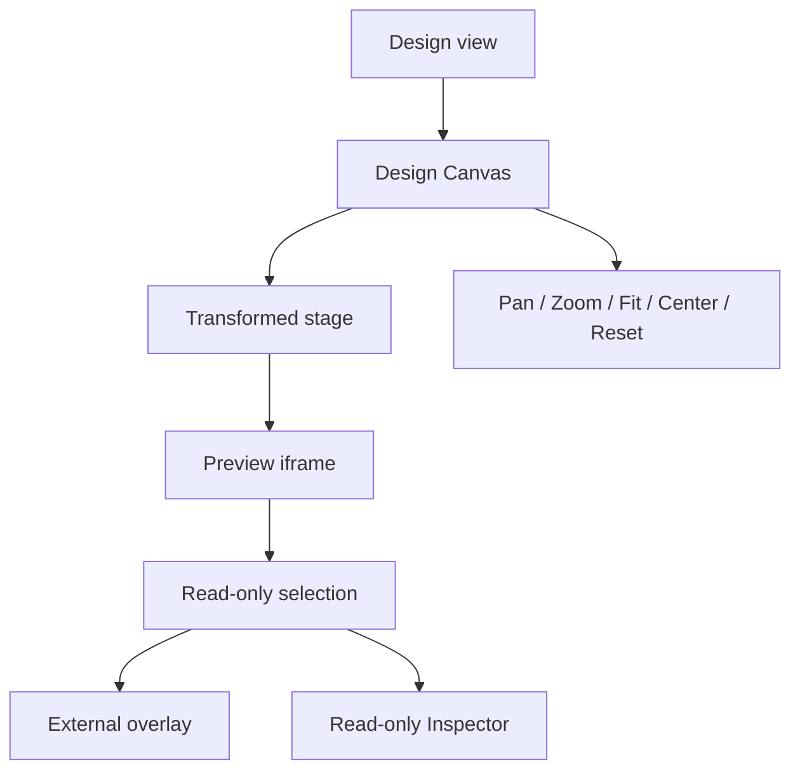

# Design view

[Docs index](../../README.md)

## Purpose

Design view presents the page as a navigable workspace while keeping Preview, selection, and inspection read-only. It is the visual center of Crystal, not a shortcut around command and source boundaries.

## Current implementation

The view hosts Design Canvas, which transforms the Preview stage through pan, zoom, Fit, Center, and Reset. Selection state can produce an external overlay and Inspector context. Toolbar, Preview controls, issues, and summary panels remain outside the transformed stage.

## Key files

- `apps/desktop/electron/renderer/views/design/design.html`
- `apps/desktop/electron/renderer/views/design/design.scss`
- `apps/desktop/electron/renderer/components/design-canvas/project-design-canvas.ts`
- `packages/core/project/design-canvas`
- `scripts/validate-design-canvas.mjs`

## Data flow

Pointer and wheel gestures update a bounded viewport model. Renderer applies the transform to the Preview stage. Selection rectangles are projected through frame and canvas geometry. Inspector and diagnostics consume derived state outside the stage.

## Boundaries

Design view cannot insert, delete, move, resize, or edit project nodes. It does not read `iframe.contentDocument`, calculate a live box model, apply styles, or persist files. Navigation state is not project source state.

## Validation

`validate:design-canvas` checks transform bounds, gesture classification, Fit/Center/Reset, viewport recovery, and forbidden behavior. `validate:visual-selection-overlay` covers selection projection.

## Related docs

- [Visual Selection Overlay](../preview/visual-selection-overlay.md)
- [Preview Selection](../preview/preview-selection.md)
- [Runtime boundaries diagram](../diagrams/runtime-boundaries.md)

## Future work

Future visual editing must produce validated commands and pass through source freshness, transaction, persistence, history, and refresh gates. Direct DOM manipulation is not an acceptable Design view implementation.
