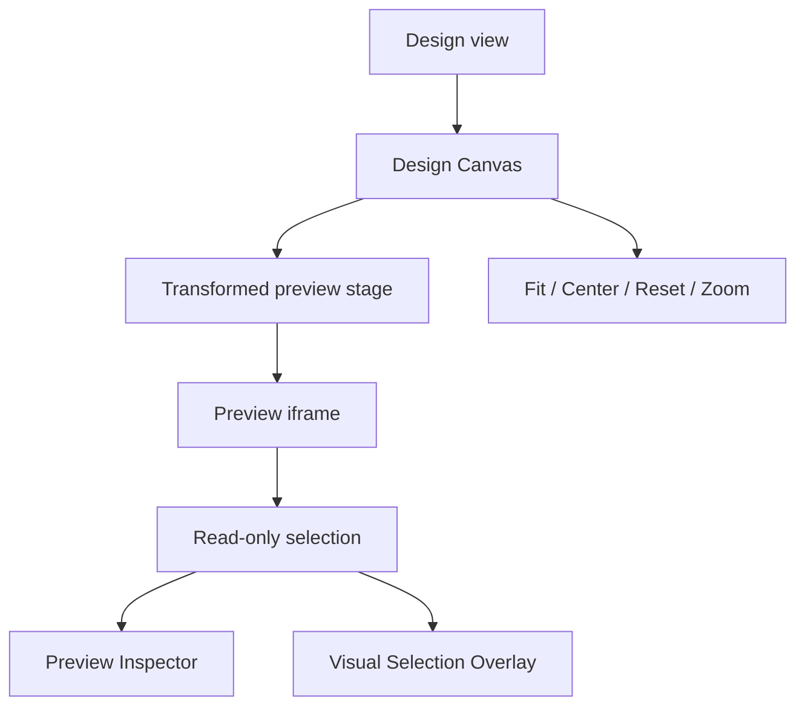

# Design View

[Docs index](../../README.md)

## Purpose

This document explains the current Design view composition and its read-only boundary.

## Current implementation

The Design view hosts the Project Preview surface through the Design Canvas component. It also integrates state-driven panels such as DOM Tree, Preview Inspector, Visual Selection Overlay, and Element Library through the broader shell. Current Design behavior is navigation and inspection, not editing.

## Key files

- `apps/desktop/electron/renderer/views/design/design.html`
- `apps/desktop/electron/renderer/views/design/design.scss`
- `apps/desktop/electron/renderer/components/design-canvas/project-design-canvas.html`
- `apps/desktop/electron/renderer/components/design-canvas/project-design-canvas.ts`
- `packages/core/project/design-canvas/**`
- `scripts/validate-design-canvas.mjs`

## Data flow

User navigation gestures update Design Canvas viewport state. The transformed stage moves the Preview frame. Preview controls, Inspector, issues, and selection summaries remain outside the transform. Selection and overlay data flow from Preview Selection and DOM Snapshot, not from direct iframe inspection.

## Boundaries

The Design view must not edit HTML, insert elements, move nodes, edit text, edit attributes, compute styles, inspect the live box model, read `iframe.contentDocument`, or write files. It must not introduce persistent overlay DOM inside the user's document.

## Validation

`validate:design-canvas` checks viewport state, safe zoom, gesture classification, recovery controls, and forbidden behavior. `validate:visual-selection-overlay` covers the external overlay boundary.

## Related docs

- [Design Canvas diagram](../diagrams/runtime-boundaries.md)
- [Visual Selection Overlay](../preview/visual-selection-overlay.md)
- [Preview Selection](../preview/preview-selection.md)

## Future work

Future Design Editing MVP must route operations through validated commands, source patch apply, history/undo transaction state, and refresh planning. It must not be implemented as direct renderer DOM mutation.
