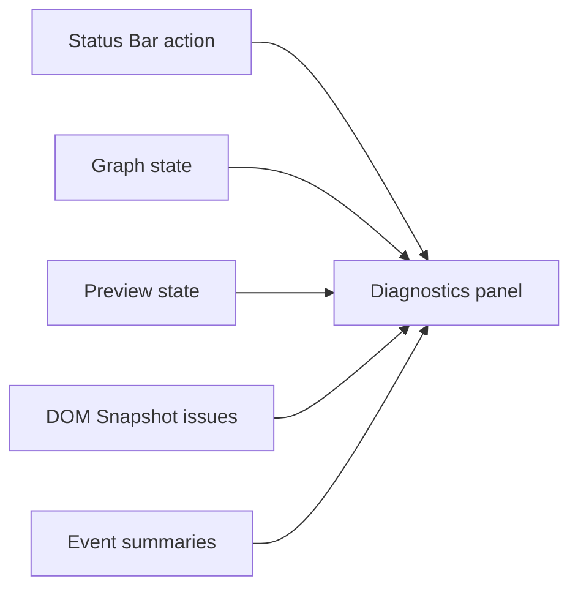

# Diagnostics

[Docs index](../../README.md)

## Purpose

Diagnostics makes hidden application state visible so contributors can understand a broken project, Preview, Snapshot, or event flow without reaching for privileged data.

## Current implementation

A floating shell panel presents graph, Preview, DOM Snapshot, and event information from already-sanitized renderer state. It supports explicit open/close, pinning, drag, resize, viewport recovery, and contained scrolling. The panel remains informational.

## Key files

- `apps/desktop/electron/renderer/components/diagnostics-panel`
- `apps/desktop/electron/renderer/layout/status-bar/status-bar.html`
- `apps/desktop/electron/renderer/layout/status-bar/status-bar.scss`
- `scripts/validate-ui-flow.mjs`

## Data flow

Feature controllers publish sanitized state. Diagnostics derives compact rows and issue summaries. Panel position and size remain renderer-local. No diagnostic interaction calls a hidden project command.

## Boundaries

Diagnostics does not expose absolute paths, raw IPC, direct filesystem reads, iframe internals, Apply actions, or command execution. DevTools remains a separate explicit app action.

## Validation

`validate:ui-flow` guards panel integration, recoverable geometry, status routing, and the manual DevTools contract.

## Related docs

- [Status Bar](./status-bar.md)
- [Validation system](../validation-system.md)
- [Preview safety](../preview/preview-safety.md)

## Future work

Richer structured logs and validation summaries may be useful, but each new action needs an explicit safe contract. The panel should not become an unreviewed command console.
