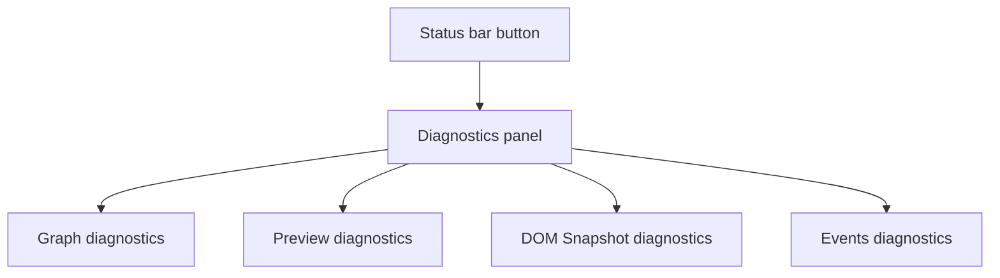

# Diagnostics

[Docs index](../../README.md)

## Purpose

This document describes the renderer Diagnostics surface and the system state it exposes.

## Current implementation

Diagnostics is a shell UI feature for observing graph, preview, DOM, and event state. It is integrated into the current carbon shell as a floating panel with open/close, pin/unpin, drag, resize, viewport recovery, and scroll containment. It is informational only.

## Key files

- `apps/desktop/electron/renderer/layout/status-bar/status-bar.html`
- `apps/desktop/electron/renderer/layout/status-bar/status-bar.scss`
- `apps/desktop/electron/renderer/components/diagnostics-panel/**`
- `scripts/validate-ui-flow.mjs`

## Data flow

Diagnostics reads already-sanitized renderer state and shell events. It does not request privileged data directly. It presents status and issues to help developers understand active project, Preview, DOM Snapshot, and event state.

## Boundaries

Diagnostics must not become a hidden command execution panel. It must not expose raw absolute paths, direct filesystem reads, write controls, iframe internals, or apply actions. DevTools opening remains an explicit Status Bar action, not an automatic side effect of `npm run dev`.

## Validation

`validate:ui-flow` guards Diagnostics placement, status flow, and DevTools behavior.

## Related docs

- [Status bar](./status-bar.md)
- [Validation system](../validation-system.md)
- [Preview safety](../preview/preview-safety.md)

## Future work

Future Diagnostics may expose richer structured logs and validation summaries, but it should remain read-only unless a specific safe action is designed and validated.
