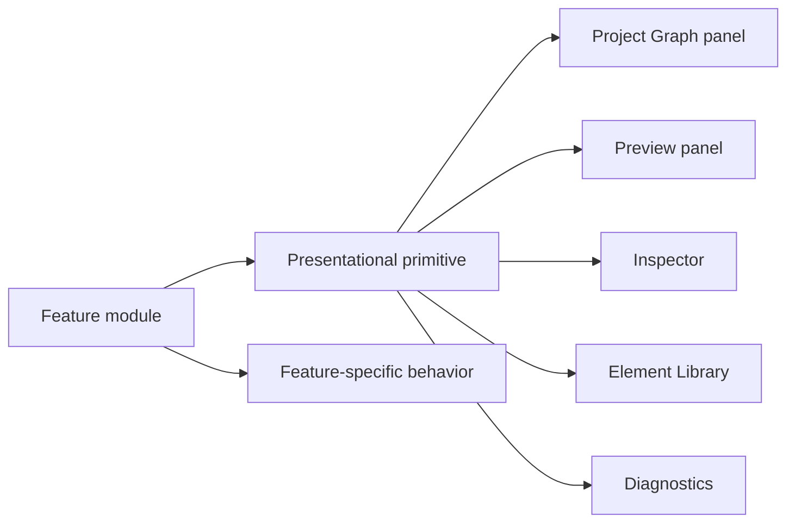

# Shell UI primitives

[Docs index](../../README.md)

## Purpose

Shared primitives keep panel chrome consistent without turning the renderer into a component framework or centralizing feature behavior.

## Current implementation

Small HTML, SCSS, and TypeScript helpers cover panel headers, sections, scroll regions, sidebar stacks, metadata rows, empty states, status badges, and compact controls. Feature panels compose them and own their own state, subscriptions, and actions.

## Key files

- `components/shell-ui/panel-header`
- `components/shell-ui/panel-section`
- `components/shell-ui/status-badge`
- `components/shell-ui/metadata-row`
- `components/shell-ui/empty-state`
- `components/shell-ui/compact-control`

## Data flow

Feature code supplies content and metadata to a primitive, then attaches feature behavior outside the primitive. The primitive may format or render a small value, but it does not subscribe to project state or call preload.

## Boundaries

Primitives remain presentational. They must not call `window.crystal`, access Preview internals, mutate project state, dispatch commands, or silently coordinate multiple features.

## Validation

`validate:ui-flow` checks current shell structure and class hooks. Feature validators remain responsible for behavior and disabled-state guarantees.

## Related docs

- [Renderer shell](./README.md)
- [Sidebar composition](./sidebar-composition.md)
- [ADR 0004](../../decisions/0004-modular-shell-ui-primitives.md)

## Future work

Extend a primitive when multiple panels need the same stable pattern. Avoid a generalized design-system layer that obscures ownership or creates abstractions ahead of use.
