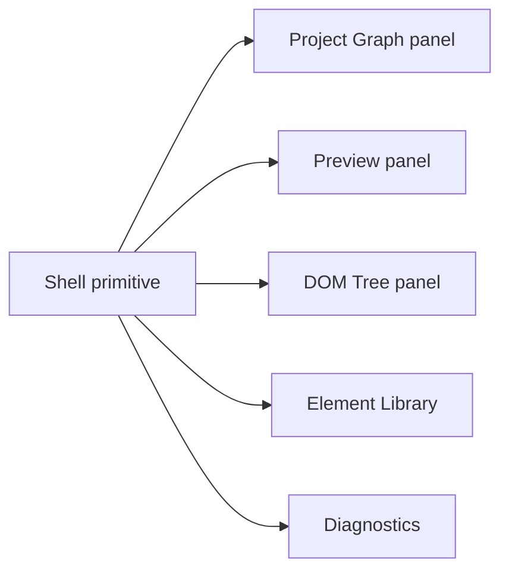

# Shell UI Primitives

[Docs index](../../README.md)

## Purpose

This document describes the shared renderer shell primitives used to keep the UI modular and consistent.

## Current implementation

The shell uses small CSS/HTML/TS primitives for panel headers, panel sections, scroll regions, sidebar stacks, status badges, metadata rows, empty states, and compact controls. Feature panels compose these primitives instead of recreating one-off chrome.

## Key files

- `apps/desktop/electron/renderer/components/shell-ui/panel-header/panel-header.html`
- `apps/desktop/electron/renderer/components/shell-ui/panel-header/panel-header.scss`
- `apps/desktop/electron/renderer/components/shell-ui/panel-section/panel-section.html`
- `apps/desktop/electron/renderer/components/shell-ui/panel-section/panel-section.scss`
- `apps/desktop/electron/renderer/components/shell-ui/status-badge/status-badge.scss`
- `apps/desktop/electron/renderer/components/shell-ui/metadata-row/metadata-row.ts`
- `apps/desktop/electron/renderer/components/shell-ui/empty-state/empty-state.ts`
- `apps/desktop/electron/renderer/components/shell-ui/compact-control/compact-control.scss`

## Data flow

Primitives provide markup, classes, and tiny render helpers. They do not own global state. Feature components create content, pass metadata, and attach behavior outside primitive modules.

## Boundaries

Primitives must not call preload, mutate project state, access Preview iframe internals, implement command behavior, or hide feature logic. They should remain presentation and small rendering utilities.

## Validation

`validate:ui-flow` checks current shell structure and class hooks. Feature validators ensure panels keep disabled/future actions honest.

## Related docs

- [Renderer shell README](./README.md)
- [Sidebar composition](./sidebar-composition.md)
- [Element Library](../commands/html-element-library.md)

## Future work

Expand primitives only when multiple panels need the same visual grammar. Avoid component-library sprawl that obscures feature boundaries.
