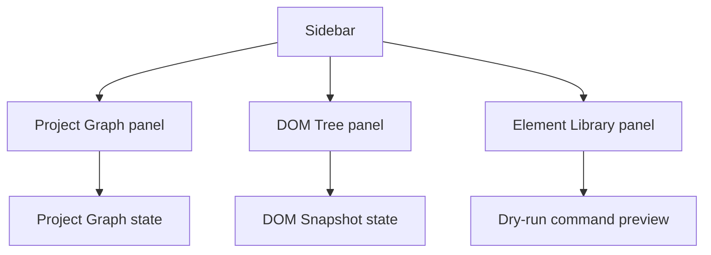

# Sidebar Composition

[Docs index](../../README.md)

## Purpose

This document explains how the current sidebar composes the read-only project tools.

## Current implementation

The sidebar groups Project Graph status, DOM Tree, and Element Library modules using shell primitives. It supports current inspection and preview planning workflows without implementing real editing.

## Key files

- `apps/desktop/electron/renderer/layout/side-bar/side-bar.html`
- `apps/desktop/electron/renderer/layout/side-bar/side-bar.scss`
- `apps/desktop/electron/renderer/components/project-graph-panel/project-graph-panel.ts`
- `apps/desktop/electron/renderer/components/project-dom-tree-panel/project-dom-tree-panel.ts`
- `apps/desktop/electron/renderer/components/html-element-library-panel/html-element-library-panel.ts`

## Data flow

Project Graph data arrives from main through preload. DOM Tree renders DOM Snapshot state. Element Library combines selected catalog item, insertion mode, Project Graph, Preview, DOM Snapshot, and Preview Selection mapping state to request a dry-run preview.

## Boundaries

Sidebar modules must not directly coordinate writes between each other. The DOM Tree is not a navigation/editing tree yet. Element Library displays command previews but its apply button remains unavailable.

## Validation

`validate:html-element-library`, `validate:dom-snapshot`, `validate:source-patch-preview`, and `validate:ui-flow` guard sidebar behavior.

## Related docs

- [HTML Element Library](../commands/html-element-library.md)
- [DOM Snapshot](../preview/dom-snapshot.md)
- [Project open flow](../flows/project-open-flow.md)

## Future work

Future sidebar work may add active tabs, tree navigation, or editing panels only after their command and security boundaries are explicit.
