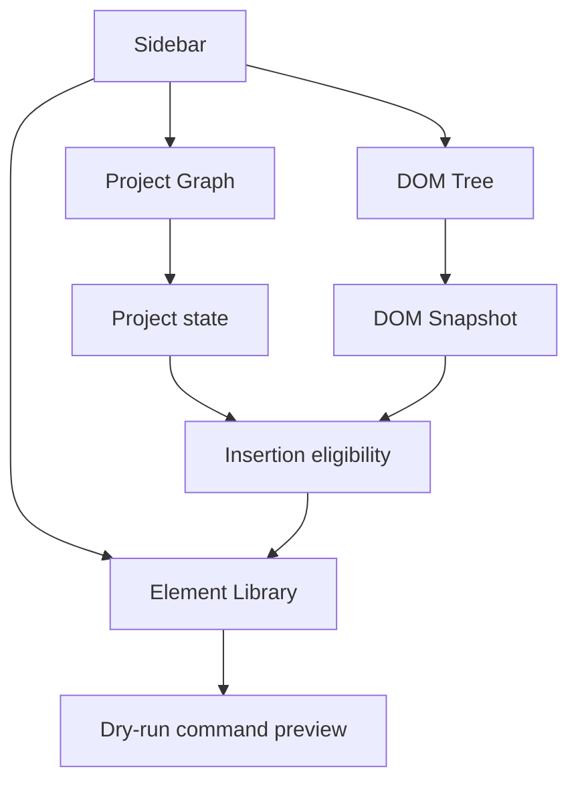

# Sidebar composition

[Docs index](../../README.md)

## Purpose

The sidebar groups source-oriented tools without making those tools coordinate hidden mutations. Its composition should help a reader move from project structure to a trustworthy target and then to dry-run intent.

## Current implementation

The sidebar hosts Project Graph status, DOM Tree, and HTML Element Library modules using shared shell primitives. Graph and Snapshot panels are read-only. The Element Library derives target eligibility from current graph, Preview, Snapshot, and selection state and shows command previews with Apply unavailable.

## Key files

- `apps/desktop/electron/renderer/layout/side-bar`
- `components/project-graph-panel`
- `components/project-dom-tree-panel`
- `components/html-element-library-panel`
- `packages/core/project/html-element-library`

## Data flow

Graph and Snapshot updates arrive through main-owned state. Selection mapping contributes target identity. The Element Library normalizes insertion modes and asks core for a dry-run preview. Each panel renders its own state rather than reaching into another panel.

## Boundaries

The DOM Tree is not an editing tree. The Element Library is not an insertion engine. Sidebar components must not call each other to coordinate writes or bypass target eligibility.

## Validation

`validate:dom-snapshot`, `validate:html-element-library`, `validate:source-patch-preview`, and `validate:ui-flow` cover the composed behavior.

## Related docs

- [HTML Element Library](../commands/html-element-library.md)
- [DOM Snapshot](../preview/dom-snapshot.md)
- [Project open flow](../flows/project-open-flow.md)

## Future work

Tabs, navigation, or additional inspectors should be added only with explicit state ownership. Editing panels remain future until command execution and persistence exist.
