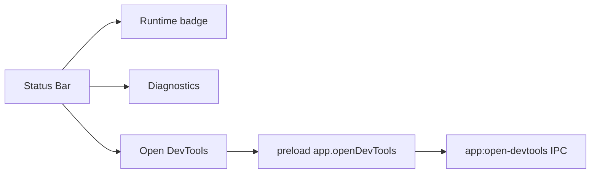

# Status Bar

[Docs index](../../README.md)

## Purpose

This document describes the Status Bar as the shell-level control surface for runtime status and developer-only shell actions.

## Current implementation

The Status Bar displays compact runtime state, a Diagnostics button, and a manual DevTools button. It is part of the shell chrome and does not change project data.

## Key files

- `apps/desktop/electron/renderer/layout/status-bar/status-bar.html`
- `apps/desktop/electron/renderer/layout/status-bar/status-bar.scss`
- `apps/desktop/electron/preload/bridges/crystal-api.bridge.ts`
- `apps/desktop/electron/main/ipc/register-app-ipc.ts`
- `scripts/validate-ui-flow.mjs`

## Data flow

The Status Bar renders status and calls controlled preload actions for app-level operations. DevTools opens only when requested by the user. Diagnostics opens the renderer Diagnostics panel.

## Boundaries

The Status Bar must not auto-open DevTools, mutate project files, expose raw IPC, or act as a write-command shortcut. It is chrome, not a feature execution surface.

## Validation

`validate:ui-flow` checks that DevTools behavior is manual and that the status/diagnostics surface remains integrated with the shell.

## Related docs

- [Diagnostics](./diagnostics.md)
- [Runtime boundaries](../runtime-boundaries.md)
- [Security model](../security-model.md)

## Future work

Future status messages should be derived from explicit state domains and remain compact. Avoid turning the Status Bar into a hidden command palette.
