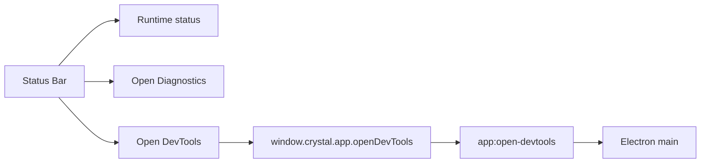

# Status Bar

[Docs index](../../README.md)

## Purpose

The Status Bar exposes compact runtime state and explicit shell-level actions without becoming an alternate command surface.

## Current implementation

It displays runtime status, opens Diagnostics, and offers a manual Open DevTools action. DevTools travels through the constrained preload API to the `app:open-devtools` main IPC handler. No Status Bar action changes project files.

## Key files

- `apps/desktop/electron/renderer/layout/status-bar/status-bar.html`
- `apps/desktop/electron/renderer/layout/status-bar/status-bar.scss`
- `apps/desktop/electron/preload/bridges/crystal-api.bridge.ts`
- `apps/desktop/electron/main/ipc/register-app-ipc.ts`
- `scripts/validate-ui-flow.mjs`

## Data flow

Renderer derives a small status summary and updates the bar. Diagnostics opens a renderer panel. DevTools uses a named preload method and main handler only when the user requests it.

## Boundaries

The Status Bar does not auto-open DevTools, expose raw IPC, mutate project source, or hide feature commands behind generic controls. It remains shell chrome.

## Validation

`validate:ui-flow` checks Status Bar placement, Diagnostics integration, and manual DevTools behavior.

## Related docs

- [Diagnostics](./diagnostics.md)
- [Runtime boundaries](../runtime-boundaries.md)
- [Security model](../security-model.md)

## Future work

New status indicators should come from explicit state domains and remain compact. A command palette, if added later, needs its own command and security model.
