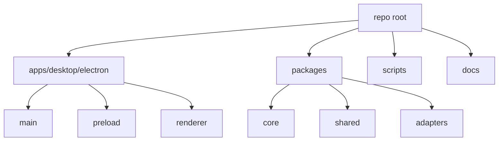

# Repository Map

[Docs index](../README.md)

## Purpose

This document maps the physical repository layout to architectural responsibility. It is not a full file inventory; it identifies the directories a developer should inspect before changing a subsystem.

## Current implementation

Crystal is organized as an npm workspace monorepo. Runtime source lives under `apps/desktop/electron`. Shared contracts, core models, adapters, and validation scripts live outside the app shell.

## Key files

- `package.json`
- `tsconfig.json`
- `scripts/build.mjs`
- `scripts/build-ts.mjs`
- `scripts/build-html.mjs`
- `scripts/build-scss.mjs`
- `apps/desktop/electron/main/main.ts`
- `apps/desktop/electron/preload/preload.ts`
- `apps/desktop/electron/renderer/main.html`
- `apps/desktop/electron/renderer/main.scss`
- `apps/desktop/electron/renderer/main.ts`

## Data flow

Build scripts assemble the modular renderer HTML, compile SCSS, and bundle TypeScript for main, preload, and renderer. Main uses adapters for filesystem and watcher effects. Core packages remain portable TypeScript. Shared packages define IPC constants, types, and validators used across runtime boundaries.

## Boundaries

- `apps/desktop/electron/main/**` may use Electron main APIs and Node IO.
- `apps/desktop/electron/preload/**` may use `contextBridge` and `ipcRenderer`, but only to expose the controlled API.
- `apps/desktop/electron/renderer/**` must remain a browser UI runtime.
- `packages/core/**` should stay pure application logic where possible.
- `packages/adapters/**` isolates external tools or Node-specific effects.
- `scripts/**` validates or builds; scripts must not become runtime feature backdoors.

## Validation

`validate:structure` checks architectural structure. Feature validators check specific source boundaries. The docs validator checks that this documentation remains navigable and includes Mermaid diagrams without requiring new dependencies.

## Related docs

- [Module boundaries](./module-boundaries.md)
- [Validation system](./validation-system.md)
- [Renderer shell docs](./renderer-shell/README.md)
- [Commands docs](./commands/README.md)

## Future work

Future directories should preserve this split. Workers should live under explicit runtime folders. Rust/WASM and WebGPU modules should be isolated behind adapters and build outputs, not scattered through renderer panels.
