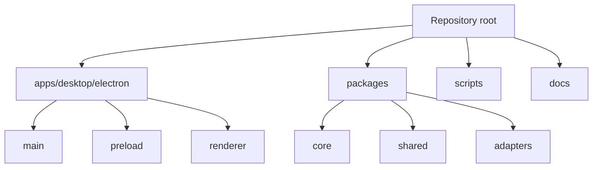

# Repository map

[Docs index](../README.md)

## Purpose

The repository map connects physical paths to architectural ownership. It helps a contributor find the right layer without treating container directories as source owners.

## Current implementation

Crystal is an npm workspace monorepo. `apps/desktop` is the registered application owner. Electron source is divided into `main`, `preload`, and `renderer`. Portable logic lives in `packages/core`, cross-runtime contracts in `packages/shared`, and effects in `packages/adapters`. Scripts build, synchronize, and validate; documentation records the model and decisions.

## Key files

- `package.json`
- `config/project-baseline.json`
- `apps/desktop/electron/main/main.ts`
- `apps/desktop/electron/preload/preload.ts`
- `apps/desktop/electron/renderer/main.ts`
- `scripts/validate-source-tree-boundaries.mjs`

## Data flow

Build scripts synchronize registered metadata, assemble HTML, compile SCSS, and bundle TypeScript. Main imports core and adapters. Preload imports shared contracts. Renderer consumes the exposed API and portable types. Documentation and validators inspect these paths but do not become runtime owners.

## Boundaries

`apps/` and `packages/` are containers, not places for unregistered source. The source-tree validator permits only the declared application, runtime, package, and metadata owners. It checks tracked paths, not import direction.

## Validation

Run `npm run validate:structure` and `npm run validate:source-tree-boundaries`. Review import direction separately because complete static import-graph enforcement is not implemented.

## Related docs

- [Module boundaries](./module-boundaries.md)
- [Runtime boundaries](./runtime-boundaries.md)
- [Development](../development.md)

## Future work

Workers, WebGPU, and Rust/WASM should enter through explicit registered owners and adapters. Their future directories must not appear as undeclared side channels.
