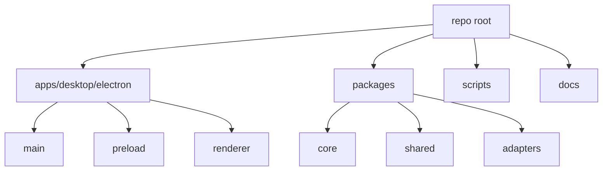

# Repository Map

[Docs index](../README.md)

## Purpose

This document maps the physical repository layout to architectural responsibility. It identifies the registered source owners a developer should inspect before changing a subsystem and the tracked-path policy that prevents new owners from appearing implicitly.

## Current implementation

Crystal is organized as an npm workspace monorepo. `apps/` and `packages/` are container roots, not product-source owners. `apps/desktop` is the only registered application owner; `apps/desktop/package.json` is its only direct metadata file. Runtime source lives under the registered `main`, `preload`, and `renderer` owners in `apps/desktop/electron`. The registered package owners are `packages/core`, `packages/shared`, and `packages/adapters`.

## Key files

- `package.json`
- `tsconfig.json`
- `scripts/build.mjs`
- `scripts/build-ts.mjs`
- `scripts/build-html.mjs`
- `scripts/build-scss.mjs`
- `apps/desktop/electron/main/main.ts`
- `apps/desktop/electron/preload/preload.ts`
- `apps/desktop/electron/renderer/main.html`
- `apps/desktop/electron/renderer/main.scss`
- `apps/desktop/electron/renderer/main.ts`

## Data flow

Build scripts assemble the modular renderer HTML, compile SCSS, and bundle TypeScript for main, preload, and renderer. Main uses adapters for filesystem and watcher effects. Core packages remain portable TypeScript. Shared packages define IPC constants, types, and validators used across runtime boundaries.

## Boundaries

- `apps/desktop/package.json` is the only tracked file permitted directly under `apps/desktop`.
- `apps/desktop/electron/main/**` may use Electron main APIs and Node IO.
- `apps/desktop/electron/preload/**` may use `contextBridge` and `ipcRenderer`, but only to expose the controlled API.
- `apps/desktop/electron/renderer/**` must remain a browser UI runtime.
- A fourth runtime root under `apps/desktop/electron/**` is rejected until its owner and validation contract are explicitly introduced.
- `packages/core/**` should stay pure application logic where possible.
- `packages/shared/**` owns cross-runtime contracts and no effects.
- `packages/adapters/**` isolates external tools or Node-specific effects.
- New tracked roots under `apps/**` or `packages/**` require an explicit policy and behavioral test update; container-level source files are rejected.
- `scripts/**` validates or builds; scripts must not become runtime feature backdoors.

## Validation

`validate:structure` checks that required source paths and generated outputs exist. `validate:source-tree-boundaries` enumerates tracked files with `git ls-files -z -- apps packages` and rejects physical source ownership outside the registered application, runtime, package, and metadata paths. It does not inspect imports. Feature validators check narrower behavior boundaries. The docs validator checks that this documentation remains navigable and includes Mermaid diagrams without requiring new dependencies.

## Related docs

- [Module boundaries](./module-boundaries.md)
- [Validation system](./validation-system.md)
- [Renderer shell docs](./renderer-shell/README.md)
- [Commands docs](./commands/README.md)

## Future work

Future directories should preserve this split. Workers should live under explicit runtime folders. Rust/WASM and WebGPU modules should be isolated behind adapters and build outputs, not scattered through renderer panels.
