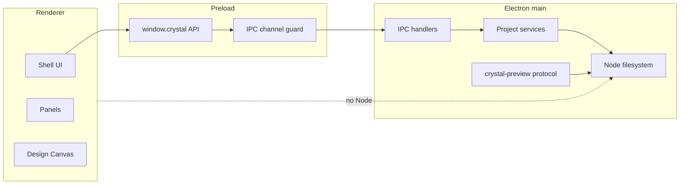

# Runtime Boundaries

[Docs index](../README.md)

## Purpose

Crystal runs trusted desktop code next to untrusted project HTML. Runtime boundaries define where authority lives so that a renderer panel, a loaded Preview page, or a future editing affordance cannot accidentally become a filesystem-capable process.

## Current implementation

There are three implemented Electron runtimes. Main owns lifecycle, windows, IPC handlers, filesystem-backed project services, watcher lifecycle, DOM Snapshot source reads, and the Preview protocol. Preload exposes a narrow `window.crystal` API. Renderer owns browser UI composition and local interaction state.

Future workers, WASM modules, and WebGPU engines are part of the product direction, but they are not runtime authority today.

The diagram should be read left to right: renderer intent goes through preload, main coordinates privileged work, core remains portable, and effects stay behind adapters.

## Key files

Use these files to trace the boundary from window creation to renderer API calls. The shared IPC files explain which messages may cross the bridge.

- `apps/desktop/electron/main/main.ts`
- `apps/desktop/electron/main/windows/create-main-window.ts`
- `apps/desktop/electron/main/security/web-preferences.ts`
- `apps/desktop/electron/preload/preload.ts`
- `apps/desktop/electron/preload/bridges/crystal-api.bridge.ts`
- `apps/desktop/electron/renderer/main.ts`
- `packages/shared/constants/ipc.constants.ts`
- `packages/shared/types/ipc.types.ts`

## Data flow

Renderer code calls `window.crystal.project.*` or `window.crystal.app.*`. Preload validates channel names and hides raw `ipcRenderer`. Main handles the request, reads or updates its in-memory service state, calls core models or adapters, and emits typed state updates back to the renderer.

## Boundaries

Renderer must not import Node filesystem primitives or main services. Main must not leak arbitrary filesystem methods through preload. Preload must not expose raw IPC. Core packages should not depend on Electron runtime APIs. These rules prevent a UI component or a loaded project page from escalating into project-wide write access.

## Validation

`validate:structure` checks the broad source layout. Feature validators add narrower guardrails around Preview, Selection, Inspector, Design Canvas, Element Library, and Source Patch Preview behavior.

## Related docs

- [Security model](./security-model.md)
- [Preview safety](./preview/preview-safety.md)
- [Runtime boundaries diagram](./diagrams/runtime-boundaries.md)
- [Module boundaries](./module-boundaries.md)

## Future work

Workers, WASM, and WebGPU should be introduced as explicit runtimes with typed ports. They should not become a side channel around preload/main security, and they should not give renderer direct write authority.
